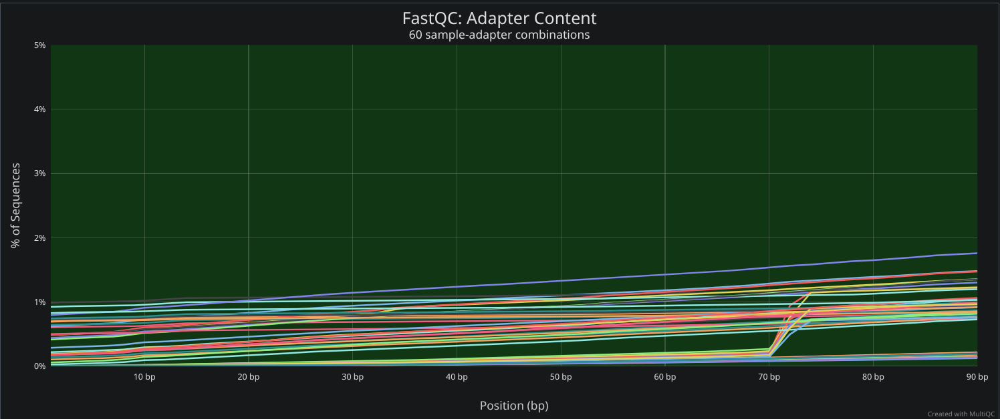
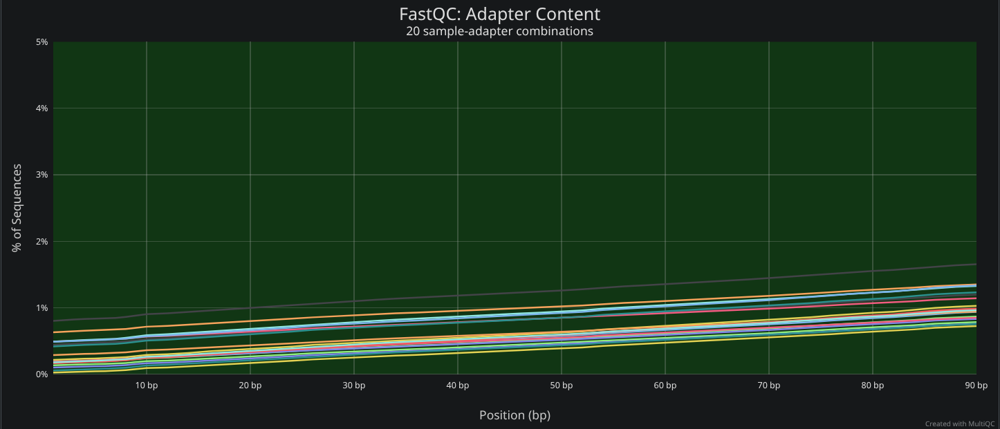
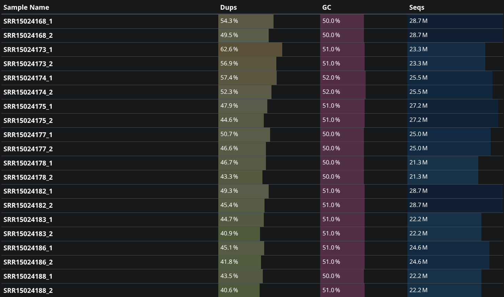
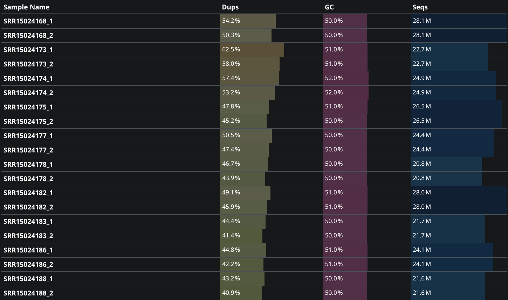
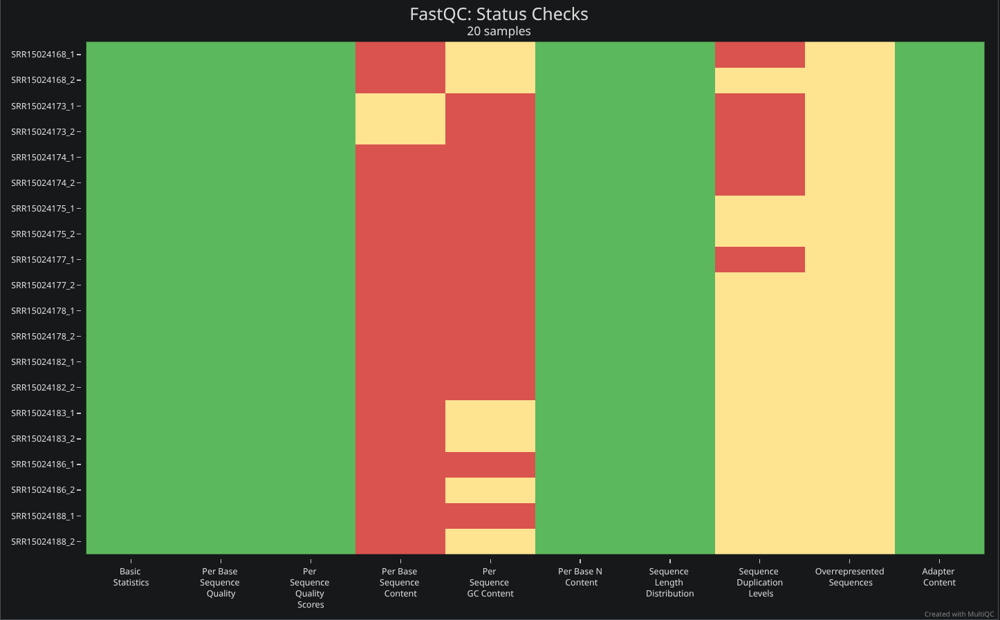
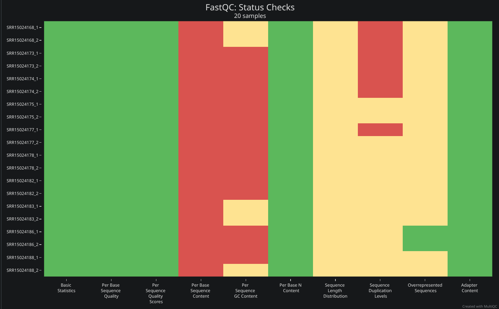
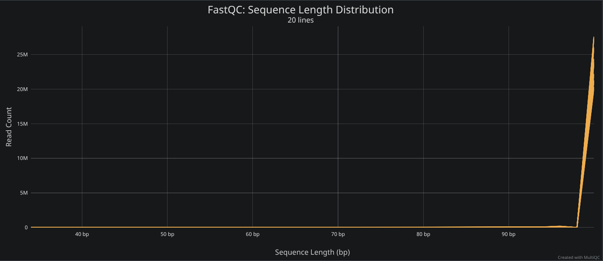
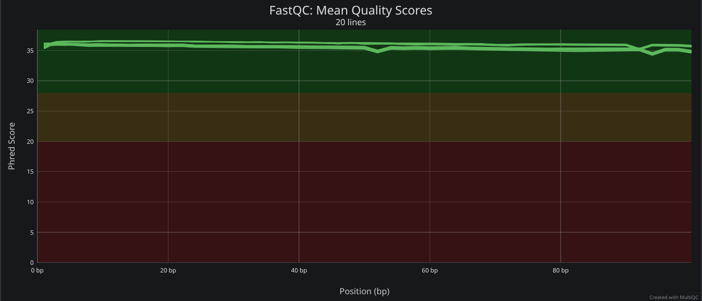
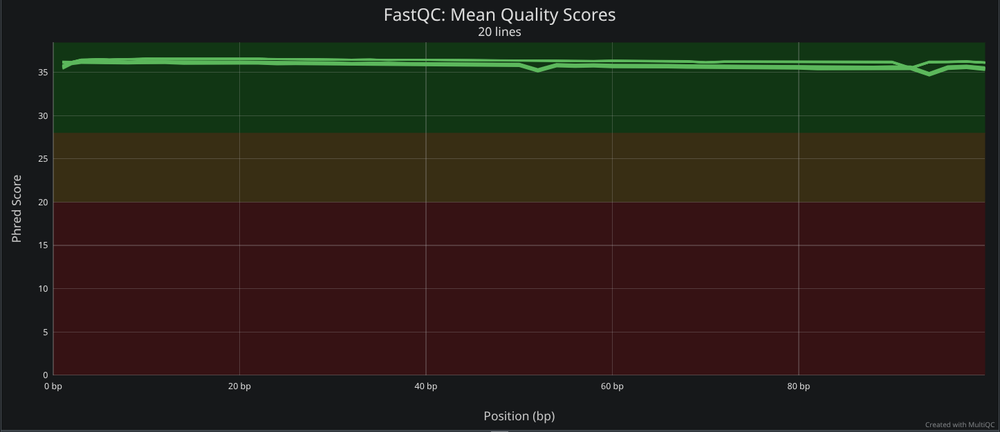
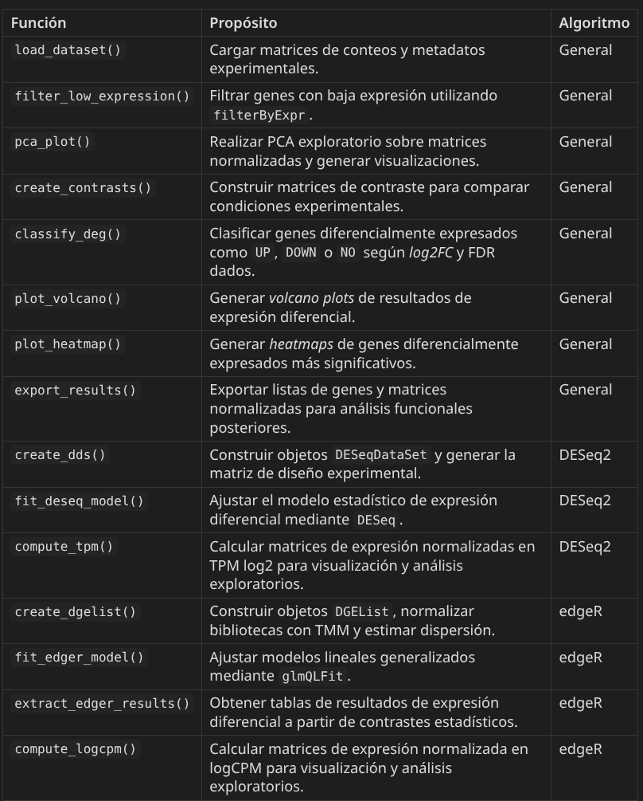

```{r setup}
#| include: false

library(reticulate)
use_python(
  "/home/majiso/.micromamba/envs/py-sci/bin/python", required = TRUE
)
py_config()
```

```{python Librerías de python}
#| echo: false
import os
import subprocess as sp
import pandas as pd
import glob
import re
import seaborn as sns
import matplotlib.pyplot as plt
import numpy as np
import gzip
from pathlib import Path
#import gseapy as gp
```

```{r Librerías de R}
#| echo: false
library(DESeq2)
library(ggplot2)
library(ComplexHeatmap)
library(dplyr)
library(tibble)
library(edgeR)
library(patchwork)
library(limma)
library(homologene)
library(org.Hs.eg.db)
library(AnnotationDbi)
```

# Introducción

## Planteamineto

El envejecimiento cerebral es un proceso biológico complejo asociado con cambios progresivos en la expresión génica, la función neuronal y la susceptibilidad a enfermedades neurodegenerativas. De esta forma, diversos estudios transcriptómicos han mostrado que el envejecimiento se acompaña de alteraciones en procesos relacionados con señalización sináptica, inflamación, metabolismo energético y respuesta al estrés celular. Sin embargo, gran parte de la información disponible presenta limitaciones asociadas con diferencias fisiológicas, simplificación del modelo o variabilidad experimental.

Los primates no humanos constituyen un modelo particularmente novedoso para el estudio del envejecimiento cerebral por la conservación de múltiples características humanas neuroanatómicas y fisiológicas. En este contexto, el artículo [*Multiregion transcriptomic profiling of the primate brain reveals signatures of aging and the social environment*](https://www.nature.com/articles/s41593-022-01197-0#Sec45) [@chiou-2022] llevó a cabo un análisis transcriptómico multirregional en cerebro de *Macaca mulatta* mediante RNA-seq, en el que se evaluaron asociaciones entre **edad**, **ambiente social** y **expresión génica cerebral**. Los datos utilizados en este proyecto fueron obtenidos del *bioproject* `PRJNA743289` y bajo el acceso **GSE179330** en GEO.

A pesar de los avances en los estudios del fenómeno, aún existen distintas limitaciones para comprender cómo es que el envejecimiento afecta de manera coordinada distintos procesos celulares en el cerebro de primates, y en consecuencia del macaco y, claro, del humano. En concreto, gran parte de los estudios transcriptómicos en envejecimiento cerebral se han realizado en modelos murinos o en tejidos humanos *post mortem*, los cuales presentan restricciones relacionadas con divergencia evolutiva en el primer caso, y en general con variabilidad individual y calidad del RNA recuperado en el segundo. Así, esto dificulta la distinción entre cambios asociados al envejecimiento fisiológico normal y vinculados más bien a procesos neurodegenerativos o artefactos experimentales [@chiou-2022].

La corteza prefrontal dorsolateral constituye una región de especial interés debido a su participación en funciones cognitivas superiores como memoria de trabajo, toma de decisiones y regulación conductual, procesos que suelen deteriorarse progresivamente con la edad. Diversos trabajos han reportado que el envejecimiento cerebral se acompaña de alteraciones en vías relacionadas con metabolismo energético, respuesta inflamatoria, comunicación sináptica y mantenimiento estructural neuronal [@chiou-2022]. Sin embargo, la magnitud y dirección de estos cambios puede variar considerablemente entre especies y regiones cerebrales, lo que evidencia las falencias de utilizar ratones para extrapolar los resultados a humano, al tiempo que resalta la relevancia de evaluar estos patrones específicamente en modelos de primates evolutivamente cercanos al *Homo sapiens*.

Por lo anterior, se optó por analizar y procesar datos del estudio de *bulk* RNA-seq provenientes de **corteza prefrontal dorsolateral** (dlPFC) de hembras jóvenes y adultas de *Macaca mulatta*. Se incluyen control de calidad de lecturas, limpieza de adaptadores, alineamiento contra el genoma de referencia, cuantificación de abundancias génicas y análisis de expresión diferencial mediante `DESeq2`. Asimismo, se hicieron análisis funcionales de enriquecimiento funcional utilizando `Gene Ontology`, `STRING` y `GSEA` en búsqueda de cambios de expresión asociados con envejecimiento cerebral normal en dlPFC de macaco, para evaluar si los patrones observados son consistentes con procesos biológicos previamente reportados en estudios de envejecimiento cerebral en primates.

## Objetivos

**Objetivo general**

- Identificar cambios de expresión génica asociados con envejecimiento cerebral en corteza prefrontal dorsolateral de hembras de *Macaca mulatta* mediante un *pipeline* basado en RNA-seq.

**Objetivos específicos**

- Filtrar y seleccionar muestras de RNA-seq de *Macaca mulatta* correspondientes a hembras jóvenes y adultas provenientes de dlPFC.

- Evaluar y mejorar la calidad de las lecturas mediante herramientas de control de calidad y limpieza de secuencias.

- Alinear las lecturas contra el genoma de referencia Mmul_10 utilizando alineadores de RNA-seq y cuantificar abundancias génicas.
- Identificar genes diferencialmente expresados entre grupos de edad utilizando `DESeq2`.
- Analizar procesos biológicos y rutas enriquecidas asociadas con los genes diferencialmente expresados mediante herramientas de enriquecimiento funcional y GSEA.
- Interpretar los cambios transcriptómicos observados en el contexto biológico del envejecimiento cerebral en primates.

# Procedimiento y resultados

> Los comandos pertenecientes a alineamientos y procesameinto posterior de datos previo al análisis de expresión diferencial propiamente dicho, se simplificaron en el cuerpo del reporte para no utilizar demasiado espacio, pero se mantuvieron en el código fuente (`./JimenezSotelo_Mateo_ProyectoFinal.qmd`) en la sección de **Anexo**, al igual que los códigos de procesamiento o *parseo* de datos, para su consulta y reproducibilidad.

## Datos

### Metadatos

Se descarga el archivo de *metadata* `SraRunTable.csv` mediante [SRA Run Selector](https://www.ncbi.nlm.nih.gov/Traces/study/?acc=PRJNA743289&o=acc_s%3Aa). Este contiene 551 muestras secuenciadas con la plataforma *Illumina NovaSeq 6000* y 31 variables asociadas a metadatos, tanto técnicos como biológicos.

```{python Inspección del dataset}
#| echo: false

metadata = pd.read_csv("./data/metadata/SraRunTable.csv")

print(f"Estructura: {metadata.shape}\nColumnas:")
print(metadata["Instrument"].value_counts())

columns_md = metadata.columns.tolist()
for i in range(0, len(columns_md), 4):
  print(columns_md[i:i+4])
```

#### Filtrado de muestras

Con el objetivo de minimizar la heterogeneidad de los datos y maximizar la potencia estadística, se opta por un filtrado de muestras considerando aquellas correspondientes a datos de *bulk RNA-seq* *paired-end* (PE) con las siguientes características:

- Sexo: **Femenino**
- Edad: Grupos de **5 a 8** y de **12 a 16** años
- Tejido: **corteza prefrontal dorsolateral** (dlPFC)

```{python Filtrado de metadatos}
#| echo: true

# Solo dlPFC PE y hembras
dlpfc_f = metadata[
  (metadata["tissue"] == "dorsolateral prefrontal cortex") &
  (metadata["LibraryLayout"] == "PAIRED") &
  (metadata["sex"] == "female")
  ]

# Filtrado por edad
young = dlpfc_f[(dlpfc_f["AGE"] >= 5) & (dlpfc_f["AGE"] <= 8)]
old = dlpfc_f[(dlpfc_f["AGE"] >= 12) & (dlpfc_f["AGE"] <= 16)]
```

```{python Inspección de muestras filtradas}
#| echo: false
# Número de muestras únicas por grupo
print(f"Número de muestras jóvenes únicas: {young.drop_duplicates(subset=['individual_id'], inplace=False).shape[0]}")
print(f"Número de muestras adultas únicas: {old.drop_duplicates(subset=['individual_id'], inplace=False).shape[0]}")
```

#### Selección de muestras

Tras el filtrado, se mantuvieron 13 muestras de IDs únicos (8 jóvenes y 5 adultas) derivadas de la misma plataforma y *batch*, con un *Average Spot Length* de 202 bp. De estas, se seleccionaron 10 (5 jóvenes y las 5 adultas) para análisis posteriores, con base en la cantidad de bases secuenciadas y buscando diversidad de edades. Consecuentemente, se eligen las muestras con mayor profundidad de secuenciación dentro del subconjunto sobrerrepresentado de 6 años.

```{python Selección final de muestras}
#| echo: true

# Se separan muestras de 6 años y las demás
young_6 = young[young["AGE"].astype(int) == 6]
young_non6 = young.drop(young_6.index)

# Se seleccionan las 2 con más bases
young_6_selected = young_6.sort_values("Bases", ascending=False).head(2)

# Conjunto joven final
young_final = pd.concat([young_non6, young_6_selected]).sort_values("AGE")
# Conjunto total final
final_samples = pd.concat([young_final, old]).sort_values("AGE")

# Columna de grupo de edad
# Young...
final_samples["AGE_group"] = "young"
# ...a menos que se vea lo contrario
final_samples.loc[final_samples["AGE"] >= 12, "AGE_group"] = "old"

# Exportar metadata filtrada y lista de SRR a descargar
os.makedirs("./data/metadata", exist_ok=True)
final_samples.to_csv("./data/metadata/selected_samples.tsv", sep="\t", index=False)
final_samples["Run"].to_csv("./data/metadata/srr_ids.txt", index=False, header=False)
```

> Tabla y lista de muestras se encuentran en `./data/metadata/`.

De esta manera, se descargan los siguientes SRR:

```{python SRR seleccionados}
#| echo: false
to_download = final_samples["Run"].tolist()
for i in range(0, len(to_download), 5):
  print(to_download[i:i+5])
```

### Descarga de datos

Se descargan los 10 *SRR*s seleccionados utilizando [`fasterq-dump`](https://github.com/ncbi/sra-tools/wiki/HowTo:-fasterq-dump) de la *suite* de herramientas SRA [@sratoolkit], con 8 núcleos y dividiendo los archivos en pares (PE). Posteriormente, se comprimen con `gzip` para optimizar almacenamiento.

```{bash Descarga de SRR}
#| eval: false
conda activate sra-tools

# Descarga de SRRs --> PE
for srr in $(cat ./data/metadata/srr_ids.txt); do
  fasterq-dump $srr --split-files --threads 8 -O ./data/raw
done

conda deactivate

# Compresión de fastqs
gzip ./data/raw/*.fastq
```

### Calidad y limpieza de datos

Se evalúa la calidad de los `fastq`s descargados con [FastQC](https://www.bioinformatics.babraham.ac.uk/projects/fastqc/) [@FastQC] y se visualiza el resumen de los resultados con [MultiQC](http://dx.doi.org/10.1093/bioinformatics/btw354) [@ewels-2016] para decidir una estrategia de limpieza homogénea para todas las muestras mediante el script `./scripts/clean_fastqs.sh` y utilizando 4 núcleos.

```{bash Calidad de datos antes de limpieza}
#| eval: false
#!/usr/bin/env bash
set -euo pipefail

INPUT_DIR="$1"
OUT_DIR="$2"
THREADS="$3"

mkdir -p "${OUT_DIR}"
fastqc -t "${THREADS}" -o "${OUT_DIR}" "${INPUT_DIR}"/*.fastq.gz
multiqc "${OUT_DIR}" -o "${OUT_DIR}"
```

```{bash Llamada a script de calidad antes de limpieza}
#| eval: false
qsub ./scripts/clean_fastqs.sh ./data/raw ./results/fastqc_raw 4
```

Las lecturas presentan una alta calidad global, teniendo un *Phred-score* consistentemente superior a 30 y contando todas con una longitud de 101 bp (consistente con el *Average Spot Length* para PE reportado en los metadatos). Aún así, se detectó un leve contenido de adaptadores hacia los extremos 3' de las lecturas, así como un contenido de *GC* discrepante del esperado teórico y niveles moderados de secuencias sobre-representadas y duplicadas.



Salvo la presencia de adaptadores, estas características son esperables en datos de *bulk RNA-seq* y no repercuten negativamente en análisis posteriores [@vallegarcia2026curso]. Por esto, se opta limpiar adaptadores y filtrar lecturas de baja calidad, sin eliminar secuencias sobre-representadas o duplicadas.

La limpieza se lleva a cabo con [`fastp`](https://pmc.ncbi.nlm.nih.gov/articles/PMC6129281/) [@chen-2018] por igual en todas las muestras, con el fin de no introducir ruido por un procesamiento heterogéneo. Se emplean detección automática de adaptadores, *trimming* de colas con baja calidad, eliminación de artefactos *polyG* y descarte de lecturas cortas (<50 bp) tras el *trimming* para evitar alineamientos inespecíficos. Esto se realiza mediante `./scripts/fastp_per_pe_sample.sh`.

> Se utilizan 8 núcleos y se generan reportes individuales en formato JSON y HTML para cada muestra, almacenanados en `./data/cleaned/` junto con los `fastq`s limpios.

```{sh Script de fastp}
#| echo: true
#| eval: false

RAW_PATH="./data/raw"
CLEANED_PATH="./data/cleaned"
mkdir -p "${CLEANED_PATH}"

conda activate fastp

for file in ${RAW_PATH}/SRR*_1.fastq.gz; do
  srr=$(basename "$file" _1.fastq.gz) # Solo el SRR

  BASE_RAW="${RAW_PATH}/${srr}"
  BASE_CLEANED="${CLEANED_PATH}/${srr}"

  # Paired End
  fastp \
    -i "${BASE_RAW}_1.fastq.gz" -I "${BASE_RAW}_2.fastq.gz" \
    -o "${BASE_CLEANED}_1.cleaned.fastq.gz" \
    -O "${BASE_CLEANED}_2.cleaned.fastq.gz" \
    --detect_adapter_for_pe --trim_poly_g \
    --cut_tail --length_required 50 --thread 8 \
    --json "${CLEANED_PATH}/${srr}.json" \
    --html "${CLEANED_PATH}/${srr}.html"
done

conda deactivate
```

Una vez limpios, se reutiliza `./scripts/clean_fastqs.sh` para evaluar la calidad de los `fastq`s procesados.

```{bash Calidad de datos después de limpieza}
#| eval: false
qsub ./scripts/clean_fastqs.sh ./data/cleaned ./results/fastqc_cleaned 4
```

Se observa que la longitud de las lecturas ahora ya no es la misma a lo largo de las muestras, lo cual es esperado dado el *trimming* y la remoción de adaptadores. En cambio, el contenido de adaptadores disminuye al tiempo que el *Phred-score* se mantiene alto.



## Alineamientos

Se utilizaron los alineadores `STAR` [@dobin2013star] y `HISAT2` [@kim2019hisat2], que *indexan* con base en un genoma de referencia provisto para mapear las lecturas. Dada la disponibilidad de recursos en el servidor `chaac`, suficientes para correr alineamientos tradicionales, y a la capacidad de estos de recuperar información posicional de las lecturas, útil para visualizaciones a nivel genómico, se optó por **no hacer** *pseudoalineamientos*.

Para la construcción de los índices de referencia de cada alineador, se utilizaron el genoma de referencia **Mmul_10** de *Macaca mulatta* **Release 115** (`./data/references/Macaca_mulatta.Mmul_10.dna.toplevel.fa`) y el GTF de anotación correspondiente (`./data/references/Macaca_mulatta.Mmul_10.115.gtf`). Ambos se obtuvieron de [Ensembl](https://www.ensembl.org/Macaca_mulatta/Info/Index) [@Ensembl2025].

```{bash Descarga de genoma de referencia}
#| eval: false
# Genoma
wget https://ftp.ensembl.org/pub/release-115/fasta/macaca_mulatta/dna/Macaca_mulatta.Mmul_10.dna.toplevel.fa.gz -O ./data/references/Macaca_mulatta.Mmul_10.dna.toplevel.fa.gz
# Anotación
wget https://ftp.ensembl.org/pub/release-115/gtf/macaca_mulatta/Macaca_mulatta.Mmul_10.115.gtf.gz -O ./data/references/Macaca_mulatta.Mmul_10.115.gtf.gz
```

El índice de STAR se construyó utilizando `--sjdbOverhang 100`, correspondiente a la longitud de lectura menos uno para lecturas PE de 101 bp. Este parámetro permite optimizar el mapeo de lecturas que abarcan uniones exón-exón al incorporar secuencias flanqueantes alrededor de los *splice junctions* anotados en el GTF de referencia [@dobin2013star].

```{bash Índice de referencia de STAR}
#| eval: false

mkdir -p ./data/references/star_index
conda activate star

STAR \
  --runThreadN 16 \
  --runMode genomeGenerate \
  --genomeDir ./data/references/star_index \
  --genomeFastaFiles ./data/references/Macaca_mulatta.Mmul_10.dna.toplevel.fa \
  --sjdbGTFfile ./data/references/Macaca_mulatta.Mmul_10.115.gtf \
  --sjdbOverhang 100 \
  > logs/star_index.log 2>&1

conda deactivate
```

```{bash Índice de referencia de HISAT2}
#| eval: false
# Sin entorno de conda
mkdir -p ./data/references/hisat2_index

hisat2-build \
  -p 8 \
  ./data/references/Macaca_mulatta.Mmul_10.dna.toplevel.fa \
  ./data/references/hisat2_index/mmul10 \
  > logs/hisat2_index.log 2>&1
```

Para el alineamiento con `STAR` se generaron directamente archivos BAM y conservaron las lecturas no alineadas mediante `./scripts/star_align.sh`

```{bash Comando básico STAR}
#| echo: true
#| eval: false

SRR=$1
DATA="./data/cleaned"
OUT="./results/aligned/star_${MODE}"
INDEX=$2
LOG_DIR="./logs/STAR"

conda activate star

INPUT="${DATA}/${SRR}_1.cleaned.fastq.gz ${DATA}/${SRR}_2.cleaned.fastq.gz"

# Incluye reads mapeados y no mapeados en el bam
/usr/bin/time -v STAR \
  --genomeDir $INDEX \
  --readFilesIn ${INPUT} \
  --readFilesCommand zcat \
  --runThreadN 8 \
  --outFileNamePrefix ${OUT}/${SRR}_ \
  --outSAMtype BAM SortedByCoordinate \
  --outSAMunmapped Within \
  2>> ${LOG_DIR}/${SRR}_time.log

conda deactivate
```

### HISAT2

```{bash comando básico HISAT2}
#| eval: false

SRR=$1
DATA="./data/cleaned"
OUT="./results/aligned/hisat2_${MODE}"
INDEX=$2

INPUT="-1 ${DATA}/${SRR}_1.cleaned.fastq.gz -2 ${DATA}/${SRR}_2.cleaned.fastq.gz"

/usr/bin/time -v hisat2 \
  -x $INDEX \
  $INPUT \
  -p 8 \
  -S ${OUT}/${SRR}.sam \
  --summary-file ${OUT}/${SRR}_summary.txt
```

Se corrieron ambos alineadores para todas las muestras descargadas como *job*s independientes y se guardan los archivos `BAM` resultantes del *output* o derivados del mismo, en el caso de `HISAT2`.

```{bash Alineamientos resumidos}
#| eval: false

DATA="./data/cleaned"
REF="./data/references"

for file in ${DATA}/SRR*_1.cleaned.fastq.gz; do
  srr=$(basename "$file" _1.cleaned.fastq.gz)

  echo "Submitting $srr"
  # STAR
  qsub ./scripts/star_align.sh -p $srr ${REF}/star_index # PE
  # HISAT2
  qsub ./scripts/hisat2_align.sh -p $srr ${REF}/hisat2_index/mmul10 #PE
done
```

Debido a que ambos alineadores recuperaron un número similar de lecturas mapeadas y a que `STAR`, si bien computacionalmente más pesado, presentó una mayor tasa de mapeo único que `HISAT2`, se optó por reportar únicamente los resultados de `STAR` en los análisis posteriores, aunque los obtenidos con `HISAT2` se mantienen disponibles para su consulta y comparación en la sección de **Anexo**.

## Filtrado

Se utilizó `samtools` (@li-2009) para filtrar los archivos `BAM`, de forma que solo queden los alineamientos con *Mapping quality* $\geq 10$ (*E-value* > 0.1), el cual es considerado el umbral estándar en *pipelines* de transcriptómica [@vallegarcia2026curso]. Posteriormente, los alineamientos se ordenaron por coordenada genómica e indexaron para optimizar su lectura y navegación, usando la *flag* `-f 64` para contar solo la primera lectura del par *PE*. Los archivos recibieron el sufijo `_fs` para denotar *filtered and sorted*.

```{bash Filtrado y sorteo de BAMs}
#| eval: false

for file in results/aligned/*/*.bam; do
  dir=$(dirname "$file")
  base=$(basename "$file" .bam)

  # Detectar modo desde carpeta
  parent=$(basename "$dir")

  # Filtro y sorteo
  fs_file="${dir}/${base}_fs.bam"
  samtools view -b -q 10 "$file" | \
  samtools sort --threads 8 -T "${dir}/${base}_fs.tmp" -o "${fs_file}"

  # Indexado
  samtools index "${fs_file}"

  # flag 64 solo para PE
  flag=""
  if [[ "$parent" == *PE ]]; then
    flag="-f 64 "
  fi

  # Conteo de reads alineadas
  samtools view ${flag}-c "$fs_file" > "${dir}/${base}_fs_counts.txt"
done
```

## Cuantificación de abundancias

Se obtuvo el conteo de lecturas por gen a partir de los `BAM` con `featureCounts`, del paquete `Subread` [@liao-2013], y el *GTF* descargado de forma previa. Se probó el parámetro de *strandness* `-s` tanto en *forward* (1) como en *reverse* (2) para evaluar la dirección de las lecturas en la librería, pero dado que las tasas de mapeo decayeron a valores promedio de 38.38% y 37.80%, respectivamente, se optó por usar `-s 0`, sin asumir direccionalidad, consiguiendo tasas de mapeo de 71.87%. Adicionalmente, se contabilizaron solo los pares correctamente alineados, cuantificaron los fragmentos completos en lugar de lecturas individules y resolvieron ambigüedades asignando cada fragmento al gen con el mayor solapamiento.

```{bash Comando de featureCounts para cuantificación de abundancias}
#| echo: true
#| eval: false

conda activate subread

# Comando con medición de tiempo y recursos
/usr/bin/time -v featureCounts \
  -o "${BAM_PATH}/counts_per_gene_${STRAND}.txt" \
  -T 8 \
  -a "${GTF}" \
  --largestOverlap \
  -p -B -s ${STRAND} \
  --countReadPairs \
  "${BAM_PATH}"/*fs.bam \
  2>> "${LOG}"

conda deactivate
```

## Matrices de conteos

Las matrices de conteos obtenidas con `featureCounts` se *reformatearon* con `./scripts/homogenize_matrixes.py` para ser compatibles con los programas de análisis de expresión diferencial, eliminando así los metadatos y ordenando las muestras en las columnas y los genes en las filas. Las matrices se guardaron en formato `tsv` en `./results/DEG/count_matrices/` y cuentan con 10 columnas, correspondientes a las 5 muestras de cada condición, y 35,432 filas, correspondientes a los genes comunes entre ambas matrices.

## Anotaciones y archivos auxiliares

A partir del archivo GTF se derivaron una tabla de correspondencia entre `gene_id` y `gene_name`, útil para la identificación de genes, y una tabla de anotación de longitudes génicas, para el cálculo de métricas normalizadas. La primera tabla encontró equivalencias para 24,482 genes pues no todos los `gene_id` presentes en la matriz de conteos poseen una anotación de `gene_name` asociada en el GTF de *Ensembl* para *Macaca mulatta*. Esto posiblemente se deba a diferencias en la calidad de las anotaciones con respecto a organismos más estudiados pero no afecta los análisis posteriores, ya que los conteos se conservaron utilizando los `gene_id`s.

## Condiciones

Se derivó una **tabla de condiciones** para cada muestra seleccionada a partir de los metadatos ya filtrados por sexo, tejido y edad (`./data/metadata/selected_samples.tsv`), con la condición en el formato `f_<group>` y el mismo número y orden de filas que las columnas de la matriz de conteos `./results/DEG/count_matrices/star_PE_counts.tsv`, de modo que los algoritmos de *DE* puedan asociar correctamente cada muestra con su información correspondiente [@vallegarcia2026curso].

```{python Orden de las muestras}
#| echo: false
#| label: tbl-samples-order
#| tbl-cap: "Orden de las muestras en la tabla de condiciones. Las muestras no se encuentran ordenadas por condición, sino que siguen el orden alfabético de las matrices de conteos. Los algoritmos de DE asocian cada muestra con su condición según el orden de las filas, y este se mantiene consistente, por lo que la estrategia de ordenado es indistinta."
#| tbl-pos: H

metadata = pd.read_csv("./results/DEG/metadata_conditions.tsv", sep="\t")
print(metadata)
```

## Expresión diferencial

El análisis de expresión diferencial se llevó a cabo en `R` con `DESeq2` [@love2014deseq2] y `edgeR` [@robinson2010edger], utilizando las matrices de conteos y las tablas de condiciones. Se usó un diseño simple con la condición de grupo de edad como única variable. Además, se consideraron como genes diferencialmente expresados (DEG) aquellos con un *adjusted p-value* < 0.05 y un valor absoluto de *log2 fold change* > 0.5, debido a que pruebas exploratorias previas con umbrales más estrictos apenas capturaban DEG.

Se utilizó el diseño $~ 0 + condition$ para modelar la expresión génica sin intercepto, permitiendo comparar las condiciones de forma explícita sin establecer ninguna condición de referencia. Este diseño facilita la interpretación de los resultados al los coeficientes del modelo corresponder directamente a cada condición, en lugar de a la diferencia respecto a una condición de referencia [@vallegarcia2026curso; @vallegarcia2026deseq2].

El análisis se llevó a cabo mediante un *pipeline* generalizado a ambos algortimos, homogenizando aquellas funciones reutilizables entre estos, manteniendo consistencia sintáctica entre las que no, y conservando los mismos parámetros estadísticos y criterios de significancia. Este consiste en los siguientes pasos:

1. Cargado de matriz de conteos asociada.
2. Construcción del objeto estadístico correspondiente (`DESeqDataSet` o `DGEList`).
3. Filtrado de genes con baja expresión.
4. Análisis exploratorio mediante PCA.
5. Normalización y modelado de dispersión.
6. Transformación de matrices para análisis exploratorio.
7. Ajuste de un modelo *binomial negativo* con diseño `~ 0 + condition`
8. Contrastes entre muestras de **5 a 8** y de **12 a 16** años.
9. Extracción de los DEG.
10. Visualización de resultados mediante *volcano plots* y *heatmaps*.

Debido a que `DESeq2` posee una integración más directa con las estrategias de visualización y normalización vistas durante el curso [@vallegarcia2026curso; @vallegarcia2026deseq2] y dado que ambos métodos recuperaron patrones globales de separación entre condiciones y DEG heterogéneos pero aún concordantes entre sí, se decidió reportar solamente sus resultados en el cuerpo del documento. Las estrategias seguidas y resultados completos de `edgeR` se incluyen en la sección de **Anexo** para fines de comparación y reproducibilidad.

A continuación se explican las decisiones tomadas en cada uno de los pasos del *pipeline*:

> Los códigos de las funciones no incluidas se encuentran en la sección de **Anexo**

- **Filtrado de genes**: El filtrado de genes con baja expresión se hizo con la función `filterByExpr`, que es nativa de `edgeR` pero se utilizó en ambos casos para mantener criterios de filtrado consistentes entre los métodos [@vallegarcia2026curso; @vallegarcia2026deseq2].

- **PCA exploratorio**: Para el PCA, pese a que existen métodos específicos en cada algoritmo para generarlo, como `vst`, en el caso de `DESeq2`, se optó por utilizar de forma generalizada la función `prcomp` del paquete `stats` de `R` base. Esta toma la matriz de conteos transformada y normalizada y usa los mismos criterios de visualización para mantener la comparabilidad entre los métodos. El *ploteo* se realizó mediante `ggplot2`. Adicionalmente, se incluyeron solo los 500 genes con mayor varianza.

- **Contrastes** Para hacer los contrastes, se utilizó la función `makeContrasts` de `limma`. Se definió el contraste `f_old - f_young` para comparar la expresión génica entre las muestras de **5 a 8** y de **12 a 16** años [@vallegarcia2026curso; @vallegarcia2026deseq2].

```{r Función para definición de contrastes}
#| echo: true
#| eval: false

create_contrasts <- function(numerator, denominator, design, variable = "condition") {
  # String del nombre del contraste --> "f_old_vs_f_young"
  contrast_name <- paste(numerator, "_vs_", denominator, sep = "")
  # Fórmula del contraste --> "conditionf_old-conditionf_young"
  contrast_formula <- paste(
    variable, numerator, "-", variable, denominator, sep = ""
  )
  # Matriz de contrastes
  contrasts <- makeContrasts(contrasts = contrast_formula, levels = design)
  # Renombrar columna
  colnames(contrasts) <- contrast_name

  return(contrasts)
}
```

- **Diseño experimental**: Se utilizó el objeto `DESeqDataSet`, construido a partir de la matriz de conteos, la tabla de condiciones y el diseño específico. Se aprovechó la misma función para generar también la matriz de diseño experimental.

```{r Función para construcción de DESeqDataSet}
#| echo: true
#| eval: false

create_dds <- function(counts, metadata, design_formula = ~ 0 + condition) {
  dds <- DESeqDataSetFromMatrix(countData = round(counts), colData = metadata, design = design_formula)
  design <- model.matrix(design_formula, data = metadata)
  return(list(dds = dds, design = design))
}
```

- **Ajuste del modelo**: `DESeq` es la función encargada de computar el modelo de DE. Por la simplicidad en cuanto a su sintaxis, se optó solo por renombrarla como `fit_deseq_model`, de forma que el flujo permanezca equivalente incluso a nivel de sintaxis entre los métodos.

- **Cálculo de TPM log2**: La normalización a TPM se deriva de la función `fpkm` de `DESeq2`, que toma como input el objeto del algoritmo usado y la tabla de anotación de longitudes génicas. El resultado es una matriz de expresión normalizada en TPM log2, utilizada para el PCA [@vallegarcia2026curso; @vallegarcia2026deseq2].

- **Clasificación de genes DEG**: Los genes se clasificaron como **UP**, **DOWN** o **NO** según los FDR y *Log2 fold-change* obtenidos de la tabla de resultados del análisis hecho con cualquiera de los algoritmos.

```{r Función para clasificación de genes DE}
#| echo: true
#| eval: false

classify_deg <- function(res, logfc_col, padj_col, lfc = 0.5, fdr = 0.05) {
  # Inicialmente todos NO
  res$DE <- "NO"

  # Upregulated
  up <- (
    res[[logfc_col]] > lfc &
    res[[padj_col]] < fdr
  )

  # Downregulated
  down <- (
    res[[logfc_col]] < -lfc &
    res[[padj_col]] < fdr
  )

  # Quitar NAs antes
  up[is.na(up)] <- FALSE
  down[is.na(down)] <- FALSE

  # Clasificación
  res$DE[up] <- "UP"
  res$DE[down] <- "DOWN"

  return(res)
}
```

- **Volcano plot y heatmap**: Las funciones para generar los *volcano plots* y *heatmaps* son análogas a las presentadas en el curso [@vallegarcia2026deseq2], salvo por la parametrización de los nombres de las columnas de *Log2 fold-change* y FDR.

> La implementación de DESeq2 recapitula los pasos previamente mencionados, por lo que no se incluye en el documento renderizado, pero permanece disponible en **esta sección** en el código fuente para su consulta y reproducibilidad.

```{r Implementación en DESeq2}
#| eval: false

# Tabla de ortólogos humano-macaco
orthologs <- read.delim("./results/GO/mmul_human_orthologs.tsv")

# Objetos para guardar resultados
deseq_results <- list()
pca_plots_deseq <- list()
volcano_plots_deseq <- list()
heatmaps_deseq <- list()

# Loop sobre datasets
for(dataset_name in names(count_files)) {
  dataset <- load_dataset(count_files[dataset_name], metadata)
  counts <- dataset$counts
  metadata_df <- metadata
  metadata_df <- metadata_df[
    match(colnames(counts), rownames(metadata_df)), , drop = FALSE
  ]
  # Construcción de DDS
  dds_data <- create_dds(counts, metadata_df)
  dds <- dds_data$dds
  design <- dds_data$design
  # Filtrado y ajuste
  dds <- filter_low_expression(dds, design)
  dds <- fit_deseq_model(dds)
  # TPM
  log2_tpm <- compute_tpm(dds, lengths)
  # PCA
  top_var_genes <- 500
  p <- pca_plot_top(log2_tpm, metadata_df,
    title = paste(dataset_name, "DESeq2, top", top_var_genes, "genes"),
    top_var_genes = top_var_genes
  )
  pca_plots_deseq[[dataset_name]] <- p
  ggsave(filename = paste0(
    "./results/plots/deseq2/pca/", dataset_name, "_pca_top", top_var_genes, ".pdf"
    ),
    plot = p, width = 6, height = 5
  )

  # Contrastes
  contrasts <- create_contrasts(
    numerator = "f_old", denominator = "f_young", design = design
  )
  # Resultados DE
  res <- as.data.frame(results(dds, contrast = contrasts[, "f_old_vs_f_young"]))
  # gene_id
  res$gene_id <- rownames(res)
  # IDs sin versiones
  gene_ids <- sub("\\..*", "", res$gene_id)
  # Match con tabla gene_name
  res$gene_name <- gene_name_map[
    match(gene_ids, gene_name_map[,1]), 2
  ]
  # Agregar símbolos humanos
  res$human_symbol <- orthologs[
    match(gene_ids, orthologs$mmul_gene_id), "human_symbol"
  ]
  # Clasificación
  res <- classify_deg(
    res, logfc_col = "log2FoldChange", padj_col = "padj", lfc = 0.5, fdr = 0.05
    )
  # Exportar resultados
  deseq_results[[dataset_name]] <- res
  saveRDS(res, paste0(
    "./results/DEG/deseq2/", dataset_name, "_results.rds"
  )
)

  # Volcano y heatmap
  v <- plot_volcano(res, logfc_col = "log2FoldChange",
    padj_col = "padj", title = paste(dataset_name, "DESeq2")
  )
  volcano_plots_deseq[[dataset_name]] <- v
  ggsave(filename = paste0("./results/plots/deseq2/volcano/",
      dataset_name, "_volcano.pdf"
    ), plot = v, width = 6, height = 5
  )
  h <- plot_heatmap(res, log2_tpm, gene_name_map,
    padj_col = "padj", title = paste(dataset_name, "DESeq2")
  )
  heatmaps_deseq[[dataset_name]] <- h
  pdf(paste0(
    "./results/plots/deseq2/heatmap/", dataset_name,"_heatmap.pdf"
    ), width = 5, height = 6
  )
  draw(h)
  dev.off()

  # Exportar resultados para análisis GO y GSEA
  export_results(res, log2_tpm, dataset_name)
}
```

Se obtuvo el siguiente PCA de las muestras analizadas con `DESeq2` a partir de los alineamientos realizados con `STAR`, utilizando los 500 genes con mayor varianza:

{width=40%}

Se observa heterogeneidad en general entre los grupos de edades, por lo que los PCs 1 y 2 no parecen explicar en gran medida la variabilidad de la edad, sino un compilado de otros aspectos, sean técnicos o biológicos. Dado que no se cuenta con metadatos adicionales para modelar un factor de confusión que pudiera ocasionar variabilidad técnica, aunado a que el envejecimiento cerebral es un proceso gradual [@chiou-2022], se opta por continuar con los análisis *downstream*.

![Gráficos de los resultados de DESeq2. A. Heatmap de los genes diferencialmente expresados más significativos obtenidos con DESeq2 a partir de alineamientos realizados con STAR. Se muestran los niveles de expresión normalizados (TPM log2 transformados a Z-score por gen) para las muestras jóvenes y adultas de *Macaca mulatta*. El patrón observado evidencia cambios transcriptómicos asociados al envejecimiento, aunque con heterogeneidad considerable entre muestras biológicas. B. Volcano plot de genes diferencialmente expresados obtenidos con DESeq2 a partir de alineamientos realizados con STAR. Se muestran los valores de log2 fold-change frente a −log10(FDR). Se consideraron como diferencialmente expresados aquellos genes con |log2FC| > 0.5 y FDR < 0.05. Los genes sobreexpresados en muestras adultas se muestran en rojo y los subexpresados en azul.](./results/plots/deseq2/de_deseq2_plots.png){width=60%}

Los resultados obtenidos muestran diferencias de expresión génica a lo largo de las muestras jóvenes y adultas, aunque con una variabilidad biológica considerable entre individuos. Aun así, los patrones observados sugieren cambios transcriptómicos moderados asociados con envejecimiento cerebral en dlPFC de *Macaca mulatta*.

## Enriquecimiento funcional

GO permite interpretar listas de DEG en términos de **procesos biológicos** (BP), **funciones moleculares** (MF) y **componentes celulares** (CC), proporcionando un marco estructurado y controlado para clasificar genes y sus productos en categorías jerárquicas, facilitando así la identificación de patrones funcionales subyacentes a los cambios de expresión observados. Así, se realizaron análisis de enriquecimiento funcional basados en términos de **GO** (*Gene Ontology*) y **KEGG** con **DAVID**, la reconstrucción de las redes de interacción *proteína-proteína* mediante **STRING**, y **GSEA** (*Gene Set Enrichment Analysis*), a partir del *ranking* global [@vallegarcia2026anotaciones].

Debido a que las colecciones funcionales de **MSigDB** [@liberzon-2015] se encuentran principalmente curadas para *Homo sapiens* y no existen colecciones *Hallmark* específicas para *Macaca mulatta*, los DEG fueron convertidos a sus ortólogos humanos mediante la tabla de correspondencia entre nombres y IDs y el paquete de `R` `homologene` [@mancarci-2018], aprovechando la alta conservación funcional entre primates. Se obtuvieron 10,956 ortólogos humanos, guardados en `./results/GO/mmul_human_orthologs.tsv`, con los identificadores originales de macaco y los símbolos asociados de ambas especies. De la misma forma, todos los conjuntos de genes del análisis de expresión diferencial (DEG, UP, DOWN y ALL) se exportan con los nombres comunes ortólogos humanos, y se utiliza su taxonomía para los análisis subsecuentes.

A pesar de haber obtenido 12 DEG (7 DOWN y 5 UP), se probó [`DAVID`](https://davidbioinformatics.nih.gov/workspace.html) [@huang2008; @sherman2022] con la intersección de cada lista con la tabla de homología, de 3 genes cada una, de forma independiente. Los genes sobreexpresados no arrojaron resultados significativos, mientras que los subexpresados arrojaron 4 términos con un *EASE threshold* de 0.1 y un *Count treshold* de 2, con *Homo sapiens* como taxonomía, el conjunto de genes presentes tras el filtrado de baja expresión como *background* y cargando únicamente la lista de los tres DEG *DOWN* (`./results/GO/DESeq2/star_PE_down.tsv`).

Si bien no se obtuvieron términos significativamente enriquecidos tras corrección por múltiples pruebas, posiblemente debido a los pocos DEG detectados, DAVID identificó funciones asociadas principalmente con procesos apoptóticos e inmunológicos. En particular, los genes `IFI27` y `TNFRSF1A` estuvieron asociados consistentemente con términos relacionados con apoptosis y respuesta inmune, lo que sugiere posibles cambios transcriptómicos vinculados con estrés celular y neuroinflamación durante el envejecimiento cerebral. Posteriormente, se probó [`ShinyGO`](https://bioinformatics.sdstate.edu/go/) [@ge-2019] con la lista de todos los DEG en aras de comparar los resultados pero no se obtuvieron enriquecimientos significativos.

```{python Tabla de resultados de DAVID resumidos}
#| echo: false
#| label: tbl-david-summarized
#| tbl-cap: "Tabla de términos enriquecidos en DAVID para genes subexpresados con DESeq2 y STAR. Se incluyen las columnas de categoría, término, p-value, Benjamini, fold enrichment y genes asociados. Los términos se ordenan por p-value de forma ascendente."
#| tbl-pos: H

# Archivo DAVID
file = "./results/GO/DESeq2/DAVID/DAVIDChartReport_star_PE_down_genes_2026-05-31.tsv"
df = pd.read_csv(file, sep="\t")

# Columnas relevantes
cols = [
    "Category",
    "Term",
    "P-Value",
    "Benjamini",
    "Fold Enrichment",
    "User Ids"
]

# Subset
summary_df = df[cols].copy()
# Ordenar por p-value
summary_df = summary_df.sort_values(by="P-Value", ascending=True)

# Renombrar
summary_df.columns = [
    "Category",
    "Term",
    "P-value",
    "Benjamini",
    "Fold enrichment",
    "Genes"
]
# Reset índice
summary_df = summary_df.reset_index(drop=True)

print(summary_df)
```

Asimismo, [`STRING`](https://string-db.org) (*Search Tool for the Retrieval of Interacting Genes/Proteins*) fue utilizado para evaluar la existencia de módulos funcionales o redes regulatorias entre los DEG, buscando asociaciones a procesos biológicos concretos [@szklarczyk2023string]. Para ello, se cargó la **lista completa de DEG**, igualmente con ortólogos humanos (`./results/GO/DESeq2/star_PE_deg_genes.tsv`), con *Homo Sapiens* como referencia. Se empleó la red completa de interacciones provista por la plataforma, que toma en cuenta asociaciones derivadas de evidencia experimental, bases de datos, coexpresión y minería de literatura [@szklarczyk2023string], con un umbral de confianza medio (*medium confidence*, 0.4).

{width=40%}

{width=100%}

La red resultante mostró agrupamientos funcionales coherentes, como un conjunto de genes relacionados con **mielina** y **oligodendrocitos**, que podrían implicar alteraciones sutiles asociadas en estas durante el envejecimiento. Adicionalmente, algunos genes se asociaron con procesos inflamatorios y apoptóticos. Asimismo, los términos enriquecidos obtenidos se relacionaron con señalización mediada por receptores melanocortínicos y funciones inmunes asociadas a receptores de TNF. Pese al número de genes diferencialmente expresados, ambos análisis mostraron consistencia entre sí mismos.

Dado que la cantidad de genes diferencialmente expresados en general era limitada, se realizó un análisis de **GSEA** (*Gene Set Enrichment Analysis*) con el ranking global de genes ordenados por la columna `res` de `DESeq2`, derivado del *estadístico de Wald*, que recapitula sobre la dirección y magnitud de expresión de los genes [@subramanian2005]. El análisis se llevó a cabo en modo *preranked*, utilizando las colecciones de conjuntos de genes *Hallmark* de **MSigDB** de *homo sapiens* [@liberzon-2015] y haciendo 1,000 permutaciones con conjuntos de entre 15 y 500 genes.

![Resultados representativos del análisis GSEA utilizando colecciones Hallmark de MSigDB. A. Enriquecimiento negativo del conjunto HALLMARK_EPITHELIAL_MESENCHYMAL_TRANSITION, indicando una acumulación coordinada de genes asociados a remodelación tisular hacia el extremo correspondiente a las muestras jóvenes. B. Enriquecimiento negativo del conjunto HALLMARK_APOPTOSIS, sugiriendo una mayor representación relativa de genes relacionados con apoptosis y respuesta a estrés celular en muestras jóvenes. C. Enriquecimiento negativo del conjunto HALLMARK_INTERFERON_ALPHA_RESPONSE, consistente con activación coordinada de genes asociados a señalización inmune e interferón. D. Relación entre el normalized enrichment score (NES) y la significancia estadística de los conjuntos Hallmark evaluados. Los puntos resaltados corresponden a conjuntos significativamente enriquecidos.](results/plots/gsea/3_gsea_hallmarks.png){width=85%}

![Resumen global de los resultados de GSEA para colecciones Hallmark. El eje X muestra el normalized enrichment score (NES) de cada conjunto génico y el eje Y los procesos biológicos evaluados. Los valores negativos indican enriquecimiento relativo hacia genes más altamente expresados en muestras jóvenes, mientras que los valores positivos indican enriquecimiento hacia muestras viejas. Los colores representan la significancia estadística corregida por FDR. Destacan procesos relacionados con transición epitelio-mesénquima, respuesta inflamatoria, señalización por interferón, apoptosis y angiogénesis.](./results/plots/gsea/gsea_hallmark_barplot.png){width=90%}

Se obtuvo un enriquecimiento significativo de vías relacionadas con respuesta inflamatoria, señalización por interferón, apoptosis, angiogénesis y transición epitelio-mesénquima (EMT). En general, estos conjuntos presentaron valores negativos de NES, indicador de un mayor representación relativa hacia genes más expresados en muestras jóvenes.

# Discusión

El análisis realizado posibilitó la identificación de cambios de expresión génica asociados con envejecimiento cerebral en corteza prefrontal dorsolateral de *Macaca mulatta*. Aunque el número de genes diferencialmente expresados fue relativamente reducido bajo los criterios de significancia empleados, los resultados obtenidos con análisis sobre el *ranking* global muestran tendencias biológicamente consistentes con procesos reportados previamente durante envejecimiento cerebral normal.

Los genes diferencialmente expresados y los análisis de enriquecimiento sugieren alteraciones relacionadas con señalización neuronal, respuesta al estrés y procesos inmunológicos. En particular, los análisis funcionales apuntan hacia una disminución de procesos asociados con actividad sináptica y regulación neuronal, así como cambios en rutas relacionadas con inflamación y respuesta celular. Estos resultados son congruentes con observaciones reportadas en el artículo original [@chiou-2022], donde el envejecimiento cerebral en macacos se asoció con disminución de genes relacionados con función neuronal y aumento de procesos asociados con respuesta inmune e inflamación.

El agrupamiento observado en el *heatmap* sugiere, además, la existencia de perfiles transcriptómicos parcialmente diferenciados entre muestras jóvenes y adultas. Esto indica que, aún con un tamaño de muestra limitado, es posible recuperar señales biológicas asociadas con la edad. De forma similar, el análisis de GSEA mostró enriquecimiento de conjuntos génicos relacionados con envejecimiento, metabolismo y respuesta celular, reforzando la consistencia biológica de los resultados obtenidos.

Inevitablemente, este trabajo presenta varias limitaciones. En primer lugar, el tamaño de muestra fue reducido, lo que disminuye la potencia estadística y probablemente limita la detección de DEG. Asimismo, el análisis se restringió a hembras y a una única región cerebral, por lo que los resultados no necesariamente representan procesos globales de envejecimiento cerebral. Aunado, al tratarse de datos de *bulk* RNA-seq, los cambios observados reflejan señales promedio de múltiples tipos celulares y no permiten distinguir contribuciones específicas de poblaciones neuronales o gliales concretas.

A pesar de estas limitaciones, el pipeline implementado permitió reproducir múltiples tendencias biológicas descritas previamente para envejecimiento cerebral en primates, mostrando que los análisis de RNA-seq constituyen una herramienta útil para estudiar procesos moleculares complejos asociados con envejecimiento y neurobiología, junto con la importancia de considerar la heterogeneidad biológica y las limitaciones inherentes a los propios datos disponibles al interpretar los resultados. Más aún, a esto le subyace la necesidad de la correcta selección de datos al llevar a cabo análisis que precisen de significancia estadística y, sobre todo, el sesgo de estudios que existe hacia organismos modelo más estudiados, lo que limita la disponibilidad de datos y herramientas para estudiar procesos biológicos en especies no tan comunes y dificulta, por tanto, los hallazgos de procesos moleculares con implicaciones clínicas potenciales.

# Conclusiones

Los resultados obtenidos permitieron identificar cambios transcriptómicos asociados con envejecimiento cerebral en corteza prefrontal dorsolateral, particularmente en procesos relacionados con señalización neuronal, respuesta inmune y estrés celular. Aunque el número de genes diferencialmente expresados fue limitado, los patrones observados fueron consistentes entre sí mismos y con hallazgos reportados previamente en estudios de envejecimiento cerebral en primates.

El uso de herramientas como `DESeq2`, `GSEA` y análisis de enriquecimiento funcional permitió interpretar los cambios de expresión génica dentro de un contexto biológico amplio, resaltando la utilidad de los enfoques transcriptómicos para estudiar mecanismos moleculares asociados con envejecimiento cerebral y demostrando que el análisis bioinformático de datos de RNA-seq permite recuperar señales biológicamente relevantes incluso a partir de subconjuntos reducidos y heterogéneos de muestras. Así, si bien constituye una aproximación útil para explorar procesos de envejecimiento y regulación génica en sistemas complejos, exhibe las limitaciones de estos estudios cuando se cuenta con un número reducido de muestras, los patrones de expresión no son tan pronunciados, se carece de un universo extenso de metadatos para modelar factores de confusión o se trabaja con especies especies no modelo con anotaciones menos completas.

\newpage

# Referencias

::: {#refs}
:::

\newpage

# Reproducibilidad

## Entorno de ejecución

* Sistema operativo local: Linux Arch (`6.19.8-arch1-1`)
* Shell utilizada: `zsh 5.9`
* Servidor de cómputo: `chaac`
* Gestor de ambientes: `conda 2.5.0`
* Documento generado mediante Quarto `1.8.27` con salida PDF vía LaTeX

## Versiones de software

* Python `3.11.14`
* R `4.5.3`
* FastQC `0.12.1`
* MultiQC `1.33`
* fastp `0.24.1`
* STAR `2.7.11b`
* HISAT2 `2.2.1`
* samtools `1.21`
* featureCounts/Subread `2.0.8`

## Datos utilizados

* Bioproyecto: `PRJNA743289`
* GEO: `GSE179330`
* Organismo: *Macaca mulatta*
* Genoma de referencia: `Mmul_10`
* Anotación génica: Ensembl Release 115

## Organización del proyecto

* `./data/`: datos crudos, referencias y archivos FASTQ procesados
* `./scripts/`: automatización y scripts auxiliares
* `./results/`: alineamientos, matrices de conteos, análisis diferenciales y enriquecimiento funcional
* `./docs/`: portada, bibliografía y archivos auxiliares de renderizado

## Pipeline general

1. Descarga de datos mediante `fasterq-dump`
2. Control de calidad con FastQC y MultiQC
3. Limpieza y filtrado de lecturas con fastp
4. Alineamiento contra el genoma de referencia mediante STAR y HISAT2
5. Filtrado, ordenamiento e indexado de BAMs utilizando samtools
6. Cuantificación de abundancias génicas mediante featureCounts
7. Análisis de expresión diferencial con DESeq2
8. Análisis funcional mediante GO, STRING y GSEA

> Adicionalmente, los parámetros relevantes utilizados durante el análisis fueron especificados explícitamente dentro del documento para facilitar la reproducibilidad completa del pipeline.

\newpage

# Anexo

## Filtrado de muestras

```{python Tabla del grupo de edad young original}
#| echo: false
#| label: tbl-young-samples
#| tbl-cap: "Tabla de muestras del grupo de edad joven (5-8 años) antes de la selección final. Se muestran las 10 muestras filtradas, ordenadas por edad y con información relevante para la selección final."
#| tbl-pos: H

# Columnas a mostrar
cols = ["Run", "AGE", "individual_id", "Bases"]

print(young[cols].sort_values("AGE"))
```

```{python Tabla del grupo de edad old original}
#| echo: false
#| label: tbl-old-samples
#| tbl-cap: "Tabla de muestras del grupo de edad adulto (12-16 años) antes de la selección final. Se muestran las 5 muestras filtradas, ordenadas por edad y con información relevante para la selección final."
#| tbl-pos: H

print(old[cols].sort_values("AGE"))
```

## Manejo de logs

Se implementó el manejo de *logs* para los scripts de descarga de SRR y limpieza de datos con el fin de facilitar la trazabilidad de los procesos. No se muestran la implementación ni el despliegue de los mismos en los *chunks* de código para evitar saturar el documento, pero se encuentran disponibles en `./scripts/` y `./logs/`, respectivamente así como en esta sección en el documento fuente (`./JimenezSotelo_Mateo_ProyectoFinal.qmd`).

```{bash Descarga de SRR + log}
#| eval: false
#| echo: false

#!/bin/bash
set -euo pipefail

mkdir -p ./data/raw

LOG="./logs/download_log.txt"
echo "Starting job on $(hostname)" > $LOG
echo "Date: $(date)" >> $LOG

conda activate sra-tools

# Descarga de SRRs --> PE
for srr in $(cat ./data/metadata/srr_ids.txt); do
  echo "Downloading $srr at $(date)" >> $LOG
  fasterq-dump $srr --split-files --threads 8 -O ./data/raw
done

conda deactivate
echo "Job finished at $(date)" >> $LOG

# Compresión de fastqs
gzip ./data/raw/*.fastq
```

```{bash Script de fastp + log}
#| eval: false
#| echo: false

#!/bin/bash
#$ -cwd
#$ -o logs/fastp_$JOB_ID.out
#$ -e logs/fastp_$JOB_ID.err

set -euo pipefail

RAW_PATH="./data/raw"
CLEANED_PATH="./data/cleaned"

mkdir -p "${CLEANED_PATH}"

LOG="./logs/fastp_log.txt"
echo "Starting job on $(hostname)" > $LOG
echo "Date: $(date)" >> $LOG

conda activate fastp

for file in ${RAW_PATH}/SRR*_1.fastq.gz; do
  srr=$(basename "$file" _1.fastq.gz) # Solo el SRR

  BASE_RAW="${RAW_PATH}/${srr}"
  BASE_CLEANED="${CLEANED_PATH}/${srr}"

  # Paired End
  fastp \
    -i "${BASE_RAW}_1.fastq.gz" -I "${BASE_RAW}_2.fastq.gz" \
    -o "${BASE_CLEANED}_1.cleaned.fastq.gz" \
    -O "${BASE_CLEANED}_2.cleaned.fastq.gz" \
    --detect_adapter_for_pe --trim_poly_g \
    --cut_tail --length_required 50 --thread 8 \
    --json "${CLEANED_PATH}/${srr}.json" \
    --html "${CLEANED_PATH}/${srr}.html"
done

conda deactivate

echo "Job finished at $(date)" >> $LOG
```

## Descarga de datos

Tamaño tras comprimir de los archivos `fastq` crudos resultantes:

```{bash Tamaño de archivos fastq crudos}
#| eval: false
du -sh ./data/raw/*fastq.gz
```

```
1.4G	./data/raw/SRR15024168_1.fastq.gz
1.5G	./data/raw/SRR15024168_2.fastq.gz
1.2G	./data/raw/SRR15024173_1.fastq.gz
1.3G	./data/raw/SRR15024173_2.fastq.gz
1.3G	./data/raw/SRR15024174_1.fastq.gz
1.4G	./data/raw/SRR15024174_2.fastq.gz
1.4G	./data/raw/SRR15024175_1.fastq.gz
1.4G	./data/raw/SRR15024175_2.fastq.gz
1.3G	./data/raw/SRR15024177_1.fastq.gz
1.3G	./data/raw/SRR15024177_2.fastq.gz
1.1G	./data/raw/SRR15024178_1.fastq.gz
1.1G	./data/raw/SRR15024178_2.fastq.gz
1.4G	./data/raw/SRR15024182_1.fastq.gz
1.5G	./data/raw/SRR15024182_2.fastq.gz
1.1G	./data/raw/SRR15024183_1.fastq.gz
1.2G	./data/raw/SRR15024183_2.fastq.gz
1.2G	./data/raw/SRR15024186_1.fastq.gz
1.3G	./data/raw/SRR15024186_2.fastq.gz
1.1G	./data/raw/SRR15024188_1.fastq.gz
1.2G	./data/raw/SRR15024188_2.fastq.gz
```

## Limpieza de datos

{width=50%}

{width=50%}

{width=50%}

{width=50%}

{width=50%}

{width=50%}

{width=50%}

## Alineamientos

Se construyó también el índice de `Salmon` pero, con base en las comparaciones realizadas en las tareas del curso y tras obtener tasas de mapeo altas en `STAR` y `HISAT2` (alineamientos hechos simultáneamente), se optó por no realizar *pseudoalineamientos*. Este requería, en lugar del genoma de referencia, un índice construido a partir de las secuencias de transcritos, también obtenidas de Ensembl [@patro2017salmon; @Ensembl2025].

```{bash Índice de referencia de Salmon}
#| eval: false

wget https://ftp.ensembl.org/pub/release-115/fasta/macaca_mulatta/cdna/Macaca_mulatta.Mmul_10.cdna.all.fa.gz -O ./data/references/Macaca_mulatta.Mmul_10.cdna.all.fa.gz

conda activate salmon

mkdir -p ./data/references/salmon_index

# k de k-mers
salmon index \
  -t ./data/references/Macaca_mulatta.Mmul_10.cdna.all.fa.gz \
  -i ./data/references/salmon_index \
  -k 31 \
  > logs/salmon_index.log 2>&1

conda deactivate
```

Se usó el siguiente *script* para la conversión de `SAM` a `BAM` de los resultados de `HISAT2`

```{bash SAM a BAM}
#| eval: false

DATA="./results/aligned"
PE="${DATA}/hisat2_PE"

for DIR in "$PE"; do

  LOG="${DIR}/sam_to_bam_log.txt"
  echo "Starting SAM to BAM conversion on $(hostname)" > $LOG
  echo "Processing directory: $DIR" >> $LOG

  for file in "$DIR"/*.sam; do
    base=${file%.sam}

    samtools sort -@ 8 -o ${base}.bam "$file"
    samtools index ${base}.bam

    if samtools quickcheck ${base}.bam; then
      rm "$file"
      echo "Successfully converted ${base}.sam \
      to ${base}.bam and removed the SAM file" >> $LOG
    else
      echo "Error converting ${base}.sam \
      to BAM. SAM file retained for debugging." >> $LOG
    fi
  done
done
```

Se generó un *dataframe* con las estadísticas de alineamiento de ambos programas con el *script* `./scripts/stats_table.py`, a partir de una estrategia híbrida de extracción de los resúmenes de alineamiento (`*.out` para `STAR` y `*.txt` para `HISAT2`), para extraer las tasas de mapeo único, y de los `BAM`s con `Samtools flagstat`, para las métricas básicas restantes [@li-2009].

### STAR

`./scripts/star_align.sh`

```{bash STAR}
#| eval: false

#!/bin/bash
#$ -cwd
#$ -pe smp 8
#$ -l h_vmem=16G
#$ -o results/aligned/star_$JOB_ID.out
#$ -e results/aligned/star_$JOB_ID.err

set -euo pipefail

# Default single-end
MODE="SE"

# Flag para paired-end
while getopts "p" opt; do # Manejo de flags
  case $opt in
    p)
      MODE="PE"
      ;;
  esac
done

shift $((OPTIND -1)) # Elimina argumentos ya procesados por getopts

SRR=$1

DATA="./data/cleaned"
OUT="./results/aligned/star_${MODE}"
INDEX=$2
LOG_DIR="./logs/STAR"

mkdir -p $OUT; mkdir -p $LOG_DIR

LOG="${LOG_DIR}/star_log.txt"
echo "Starting job on $(hostname)" > $LOG
echo "STAR alignment" >> $LOG
echo -e "\tMode: $MODE" >> $LOG
echo -e "\tSample: $SRR" >> $LOG
echo "Date: $(date)" >> $LOG

conda activate star

# /usr/bin/time para medir el tiempo y uso de recursos
INPUT="${DATA}/${SRR}_1.cleaned.fastq.gz"
if [ "$MODE" = "PE" ]; then
  # Ambos argumentos en la misma variable
  INPUT="${DATA}/${SRR}_1.cleaned.fastq.gz ${DATA}/${SRR}_2.cleaned.fastq.gz"
fi

# Incluye reads mapeados y no mapeados en el bam
/usr/bin/time -v STAR \
  --genomeDir $INDEX \
  --readFilesIn ${INPUT} \
  --readFilesCommand zcat \
  --runThreadN 8 \
  --outFileNamePrefix ${OUT}/${SRR}_ \
  --outSAMtype BAM SortedByCoordinate \
  --outSAMunmapped Within \
  2>> ${LOG_DIR}/${SRR}_time.log

conda deactivate
```

### Hisat2

> `HISAT2` no tiene un entorno de *Conda* propio.

Se utilizó `./scripts/hisat2_align.sh`.

```{bash Hisat2}
#| eval: false

#!/bin/bash
#$ -cwd
#$ -pe smp 8
#$ -l h_vmem=8G
#$ -o results/aligned/hisat2_$JOB_ID.out
#$ -e results/aligned/hisat2_$JOB_ID.err

set -euo pipefail

# Default single-end
MODE="SE"

# Flag para paired-end
while getopts "p" opt; do
  case $opt in
    p)
      MODE="PE"
      ;;
  esac
done

shift $((OPTIND -1))

SRR=$1

DATA="./data/cleaned"
OUT="./results/aligned/hisat2_${MODE}"
INDEX=$2
LOG_DIR="./logs/HISAT2"

mkdir -p $OUT
mkdir -p $LOG_DIR

LOG="${LOG_DIR}/hisat2_log.txt"
echo "Starting job on $(hostname)" > $LOG
echo "HISAT2 alignment" >> $LOG
echo -e "\tMode: $MODE" >> $LOG
echo -e "\tSample: $SRR" >> $LOG
echo "Date: $(date)" >> $LOG

# /usr/bin/time para medir el tiempo y uso de recursos
if [ "$MODE" = "SE" ]; then
  INPUT="-U ${DATA}/${SRR}_1.cleaned.fastq.gz"
else
  INPUT="-1 ${DATA}/${SRR}_1.cleaned.fastq.gz -2 ${DATA}/${SRR}_2.cleaned.fastq.gz"
fi

/usr/bin/time -v hisat2 \
  -x $INDEX \
  $INPUT \
  -p 8 \
  -S ${OUT}/${SRR}.sam \
  --summary-file ${OUT}/${SRR}_summary.txt \
  2>> ${LOG_DIR}/${SRR}_time.log
```

```{bash Alineamientos}
#| eval: false

DATA="./data/cleaned"
REF="./data/references"

for file in ${DATA}/SRR*_1.cleaned.fastq.gz; do
  srr=$(basename "$file" _1.cleaned.fastq.gz)

  echo "Submitting $srr"
  # STAR
  qsub ./scripts/star_align.sh -p $srr ${REF}/star_index # PE
  # HISAT2
  qsub ./scripts/hisat2_align.sh -p $srr ${REF}/hisat2_index/mmul10 #PE
done
```

### flagstat y estadísticas de alineamiento

```{bash tasas y flagstat por BAM}
#| eval: false
# Tasa de mapeo único
grep -E "aligned concordantly exactly 1 time|Uniquely mapped reads %" results/aligned/*/{*out,*txt} > results/aligned/unique_mapping_rate_per_sample.txt

# Flagstat de las otras métricas
for bam in ./results/aligned/*/*.bam; do
  out="${bam%.bam}_flagstat.txt"
  samtools flagstat "$bam" > "$out"
done
```

```{python Función para extraer porcentajes}
# Extraer de procentajes en falgstat
def extract_percentage(line) -> float:
  match = re.search(r"\(([\d\.]+)%", line)
  return float(match.group(1)) if match else None
```

```{python Extracción de estadísticas de alineamiento}
#| eval: false

# === Stats de Flagstat ===

# Lista de dicts para almacenar la información
records = [] 

# Glob de todos los logs
log_files = ( glob.glob("./logs/HISAT2/*time.log") + glob.glob("./logs/STAR/*time.log") )

for log in log_files:

  # Log de tiempo y recursos correspondiente
  with open(log) as file:
    text = file.read()

  # Minutos, segundos y decimales si hay
  time_match = re.search(r"Elapsed.*: (\d+):(\d+\.?\d*)", text)
  # CPU usado
  cpu_match = re.search(r"Percent of CPU.*: (\d+)", text)
  # Memoria máxima en Kb
  mem_match = re.search(r"Maximum resident set size.*: (\d+)", text)

  # Tiempo en segundos
  time_sec = None
  if time_match:
    # Lo capturado en el group respectivo
    minutes = int(time_match.group(1))
    seconds = float(time_match.group(2))
    time_sec = minutes*60 + seconds # Más legible

  cpu = int(cpu_match.group(1)) if cpu_match else None
  mem_gb = int(mem_match.group(1)) / (1024**2) if mem_match else None

  # Metadatos a partir del path
  tool = os.path.basename(os.path.dirname(log)).upper()
  sample = os.path.basename(log).split("_")[0] # <SRR>.log --> <SRR>

  # Directorio según alineador
  align_dir = f"./results/aligned/{tool.lower()}_PE"

  # Nombre del flagstat
  flagstat_name = f"{sample}_flagstat.txt"

  if tool == "STAR":
    flagstat_name = f"{sample}_Aligned.sortedByCoord.out_flagstat.txt"

  # Path completo
  flagstat_path = os.path.join(align_dir, flagstat_name)

  # Información del alineamiento
  total = primary_mapped = primary_mapped_pct = properly_paired = None

  if os.path.exists(flagstat_path):
    with open(flagstat_path) as file:
      for line in file:
        if "in total" in line:
          total = int(line.split()[0])

        elif "primary mapped (" in line:
          primary_mapped = int(line.split()[0])
          primary_mapped_pct = extract_percentage(line)

        elif "properly paired" in line:
          properly_paired = extract_percentage(line)

  # Dict con la información del alineamiento
  records.append({
    # Muestra
    "Sample": sample,
    "Tool": tool,
    "Mode": "PE",
    # Recursos
    "Time (s)": time_sec,
    "Memory (GB)": mem_gb,
    "CPU (%)": cpu,
    # Estadísticas de alineamiento
    "Total reads": total,
    "Primary mapped reads": primary_mapped,
    "Primary mapped (%)": primary_mapped_pct,
    "Properly paired (%)": properly_paired
  })

df = pd.DataFrame(records)

# === Stats de mapeo único ===

unique_records = []

with open("./results/aligned/unique_mapping_rate_per_sample.txt") as file:
  for line in file:
    # STAR
    if "Uniquely mapped reads %" in line:
      sample_match = re.search(r"(SRR\d+)", line)
      pct_match = re.search(r"([\d\.]+)%", line)
      sample = sample_match.group(1)
      pct = float(pct_match.group(1))
      unique_records.append({
        "Sample": sample,
        "Tool": "STAR",
        "Unique mapping (%)": pct
      })

    # HISAT2
    elif "aligned concordantly exactly 1 time" in line:
      sample_match = re.search(r"(SRR\d+)", line)
      pct_match = re.search(r"\(([\d\.]+)%\)", line)
      sample = sample_match.group(1)
      pct = float(pct_match.group(1))
      unique_records.append({
        "Sample": sample,
        "Tool": "HISAT2",
        "Unique mapping (%)": pct
      })

unique_df = pd.DataFrame(unique_records)

# === Merge de ambos ===

df = df.merge(unique_df, on=["Sample", "Tool"], how="left")
# Exportamos el df a tsv
df.to_csv("./results/aligned/alignment_stats.tsv", sep="\t", index=False)
```

```{python Mostrar estadísticas de alineamiento}
#| echo: false
#| label: tbl-alignment-stats
#| tbl-cap: "Muestras jóvenes seleccionadas para el análisis transcriptómico y sus estadísticas de alineamiento."
#| tbl-pos: H

stats_df = pd.read_csv("./results/aligned/alignment_stats.tsv", sep="\t")
print(stats_df)
```

## FeatureCounts

```{bash featureCounts}
#| eval: false

#!/bin/bash
#$ -cwd
#$ -o results/featureCounts/featureCounts_$JOB_ID.out
#$ -e results/featureCounts/featureCounts_$JOB_ID.err
#$ -pe smp 8

set -euo pipefail

BAM_PATH=$1
GTF=$2
STRAND=$3

LOG="${BAM_PATH}/featureCounts_${STRAND}_log.txt"
echo "Starting job on $(hostname)" >> "$LOG"
echo "FeatureCounts" >> "$LOG"
echo -e "\tMode: PE" >> "$LOG"
echo -e "\tStrand type: $STRAND" >> "$LOG"
echo -e "\tPath: $BAM_PATH" >> "$LOG"
echo "Date: $(date)" >> "$LOG"

conda activate subread

# Comando con medición de tiempo y recursos
/usr/bin/time -v featureCounts \
  -o "${BAM_PATH}/counts_per_gene_${STRAND}.txt" \
  -T 8 \
  -a "${GTF}" \
  --largestOverlap \
  -p -B -s ${STRAND} \
  --countReadPairs \
  "${BAM_PATH}"/*fs.bam \
  2>> "${LOG}"

conda deactivate
```

```{bash Ejecución de featureCounts}
#| eval: false
#| echo: true

SCRIPT="./scripts/make_featureCounts.sh"
ALIGN_PATH="./results/aligned"
GTF="./data/references/Macaca_mulatta.Mmul_10.115.gtf"

# Barrido de tipo de librería
for i in {0..2}; do
  qsub "$SCRIPT" "${ALIGN_PATH}/hisat2_PE" "$GTF" "$i"
  qsub "$SCRIPT" "${ALIGN_PATH}/star_PE" "$GTF" "$i"
done
```

Resultados:

```{python DF de conteos de featureCounts}
#| eval: true
#| echo: true
#| message: true

path = "./results/aligned/hisat2_PE/"

def load_fc_counts(path) -> pd.DataFrame:
  return pd.read_csv(path, sep="\t", comment="#", engine="python")

fc_dfs = {}
# Leer cada archivo de conteos
for strand in range(3): # 0, 1, 2 para los tipos de strand
  for aligner in ["hisat2_PE", "star_PE"]:
    fc_dfs[f"fc_{aligner}_{strand}"] = (df := load_fc_counts(f"./results/aligned/{aligner}/counts_per_gene_{strand}.txt"))
    print(f"{aligner} y strandness {strand}:")
    print(df.head())
```

Tasas promedio de mapeo tras `featureCounts`, por tipo de alineador y strandness:

```{python Tasa de mapeo de featureCounts}
#| label: tbl-fc-mapping-rates
#| tbl-cap: "Tasas de mapeo promedio obtenidas con `featureCounts` para cada alineador y tipo de strandness."
#| tbl-pos: H

files = glob.glob("./results/aligned/*/featureCounts_*_log.txt")

# Lista de dicts
rows = []

for file in files:
  # Alineador
  aligner = file.split("/")[3]

  # Strandness
  strand = re.search(r"featureCounts_(\d)_log", file).group(1)
  with open(file) as f:
    for line in f:
      if "Successfully assigned alignments" in line:
        pct = extract_percentage(line)
        rows.append({
          "aligner": aligner,
          "strandness": int(strand),
          "mean_percentage": pct
        })

# DataFrame largo
fc_mapping = pd.DataFrame(rows)

# Promedios
fc_mapping_summary = (
  fc_mapping.groupby(["aligner", "strandness"])
  ["mean_percentage"].mean().reset_index()
  .sort_values(["aligner", "mean_percentage"], 
  ascending=[True, False])
)

print(fc_mapping_summary)
```


```{python Homogenización de matrices}
# Path de los archivos de conteo
RESULTS_DIR = Path("./results/aligned")

# Lista de cuantificadores a procesar
cuants = ["hisat2_PE", "star_PE"]

# Dict de los paths de cada matriz
count_files = {cuant: RESULTS_DIR / cuant / "counts_per_gene_0.txt" for cuant in cuants}

# Path para guardar matrices homogenizadas
OUTPUT_DIR = Path("./results/DEG/count_matrices")
OUTPUT_DIR.mkdir(parents=True, exist_ok=True)

# Limpieza de matrices
def clean_matrix(df) -> pd.DataFrame:
  """
  Pasos generales de homogenización para matrices de conteos.
  """
  # Limpiar nombres de muestras
  df.columns = clean_sample_names(df.columns)
  # Convertir el input a numérico
  df = df.apply(pd.to_numeric)
  # Siempre valores enteros (salmon tiene floats)
  df = df.round().astype(int)
  
  return df

# Limpieza de nombres de muestras
def clean_sample_names(columns) -> list:
  """
  Homogeniza los nombres de las muestras a partir de los nombres de las columnas,
  eliminando partes comunes y dejando solo el identificador de la muestra.
  """
  # Lista de nombres limpios
  cleaned = []
  for col in columns:
    # Quitar path y dejar solo el nombre del archivo
    sample = re.sub(r".*/", "", col)
    # Quitar sufijos de las tablas de STAR
    sample = re.sub(r"_Aligned.sortedByCoord.out.fs.bam", "", sample)
    # Quitar sufijos de las tablas de HISAT2
    sample = re.sub(r"\.fs\.bam", "", sample)

    cleaned.append(sample)
  return cleaned

# Carga de matrices de featureCounts
def load_featurecounts_matrix(path) -> pd.DataFrame:
  """
  Carga matriz de conteos de featureCounts, eliminando columnas de metadatos y
  homogenizando nombres de muestras.
  """
  # Cargar tabla de conteos
  df = pd.read_csv(path, sep="\t", comment="#")
  # Quitar columnas no necesarias, si existen
  df = df.drop(columns=["Chr", "Start", "End", "Strand", "Length"], errors="ignore")
  # gene_id como índice
  df = df.set_index("Geneid")

  return clean_matrix(df)

# Si hubiera de Salmon
def load_salmon_matrix(path) -> pd.DataFrame:
  """
  Carga matriz de conteos de salmon.
  """
  df = pd.read_csv(path, sep="\t", index_col=0)
  return clean_matrix(df)

def load_matrix(path, method="featureCounts") -> pd.DataFrame:
  """
  Wrapper para cargar matrices de conteos, dependiendo del método de cuantificación utilizado.
  """
  if method.lower() == "salmon":
    return load_salmon_matrix(path)
  return load_featurecounts_matrix(path)

# Pipeline de homogenización

# Dict para las matrices de conteos
matrices = {}

for dataset, path in count_files.items():
  # Método según el nombre del dataset 
  method = "salmon" if "salmon" in dataset.lower() else "featureCounts"
  # Guardar matriz limpia en el dict
  matrices[dataset] = load_matrix(path, method)

# Encontrar genes comunes entre las matrices
# '*' desempaqueta la lista de sets para ser argumento del set
common_genes = set.intersection(*[set(df.index) for df in matrices.values()])

# Ordenar los genes
common_genes = sorted(common_genes)

print(f"Genes comunes entre las matrices: {len(common_genes)}")

for dataset in matrices:
  df = matrices[dataset]

  # Solo las filas de los genes comunes
  df = df.loc[common_genes]
  # Ordenar columnas alfabéticamente --> Iguales entre matrices
  df = df[sorted(df.columns)]
  # Matriz filtrada y ordenada en el dict
  matrices[dataset] = df

  print(f"{dataset}: {df.shape}")

# Guardar matrices homogenizadas
for dataset, df in matrices.items():
  output_file = OUTPUT_DIR / f"{dataset}_counts.tsv"
  df.to_csv(output_file, sep="\t")
```

## Anotaciones y archivos auxiliares

Script de generación de tabla de correspondencia entre `gene_id` y `gene_name` a partir del GTF:

```{python Generación de tabla gene_id-gene_name}
#| eval: false

# Archivo GTF
gtf_file = Path("./data/references/Macaca_mulatta.Mmul_10.115.gtf.gz")

# Output
output_file = Path(output_before_drop := "./results/DEG/gene_id-gene_name.tsv")
output_before_drop = Path(f"{output_before_drop[:-4]}_before_drop.tsv")
output_file.parent.mkdir(parents=True, exist_ok=True)

# Lista para mappings
records = []

# Abrir GTF (comprimido, modo lectura de texto)
with gzip.open(gtf_file, "rt") as gtf:
  # Se recorre cada anotación...
  for line in gtf:
    # Saltar comentarios
    if line.startswith("#"):
      continue

    # Lista con los campos
    fields = line.strip().split("\t")

    # Solo entradas tipo 'gene'
    feature = fields[2]
    if feature != "gene":
      continue

    # Columna de atributos --> gene_id, gene_name, etc...
    attributes = fields[8]

    # Regex para capturar group con el valor entre comillas que sigue del atributo:
    gene_id_match = re.search(r'gene_id "([^"]+)"', attributes)
    gene_name_match = re.search(r'gene_name "([^"]+)"', attributes)

    # Agregar a lista si ambos existen
    if gene_id_match and gene_name_match:

      # EL grupo 1 es el capturado por '()'
      gene_id = gene_id_match.group(1)
      # Sin versiones del ID de Ensembl --> Todo después del punto
      gene_id = gene_id.split(".")[0]
      gene_name = gene_name_match.group(1)

      # Agregar a registros
      records.append([gene_id, gene_name])

# Convertir a DF
gene_name_map = pd.DataFrame(records, columns=["Geneid", "Gene_name"])
gene_name_map.to_csv(output_before_drop, sep="\t", index=False)

# Quitar duplicados por si hubiera genes con el mismo nombre o ID
gene_name_map = gene_name_map.drop_duplicates()
gene_name_map.to_csv(output_file, sep="\t", index=False)
```

```{python Registros antes de duplicar}
#| echo: false
#| label: tbl-gene-id-name
#| tbl-cap: "Tabla de correspondencia antes de quitar duplicados entre `gene_id` y `gene_name`, derivada del GTF. Se muestran los primeros registros."
#| tbl-pos: H

output_before_drop = "./results/DEG/gene_id-gene_name_before_drop.tsv"

df_before_drop = pd.read_csv(output_before_drop, sep="\t")

print(f"Antes de quitar duplicados: {df_before_drop.shape}")

print(df_before_drop.head())
```


```{python Registros sin duplicados}
#| echo: false
#| label: tbl-gene-id-name-clean
#| tbl-cap: "Tabla de correspondencia después de quitar duplicados entre `gene_id` y `gene_name`, derivada del GTF. Se muestran los primeros registros, con 24,482 filas."
#| tbl-pos: H

output_file = "./results/DEG/gene_id-gene_name.tsv"

df_clean = pd.read_csv(output_file, sep="\t")

print(f"Después de quitar duplicados: {df_clean.shape}")

print(df_clean.head())
```


Para la tabla de longitudes génicas se utilizan las longitudes reportadas por `featureCounts` para cada gen (`Geneid`) en la columna `Length` de sus tablas de conteo, que corresponden a su vez a la suma de las longitudes de los exones de cada gen en la anotación del GTF [@liao-2013]:

> Dado que el GTF es el mismo para ambos alineamientos, se utiliza el archivo de `featureCounts` de `star` (`./results/aligned/star/counts_per_gene.txt`).

```{python Longitudes génicas listadas}
# Archivos
counts_file = Path("results/aligned/star_PE/counts_per_gene_0.txt")
output_file = Path("results/DEG/lengths.tsv")
output_file.parent.mkdir(parents=True, exist_ok=True)

# Cargar tabla de featureCounts
annotation = pd.read_csv(counts_file, sep="\t", comment="#")
annotation = annotation[["Geneid", "Length"]] # Solo id y longitud

# Igualmente quitar verisiones de Ensembl, de haberlas, y duplicados
annotation["Geneid"] = (annotation["Geneid"].str.split(".").str[0])
annotation = annotation.drop_duplicates()

# Exportar
annotation.to_csv(output_file, sep="\t", index=False)
```

La generación de ortólogos se realiza a través de la función `homologene` del paquete `homologene` de Bioconductor, que consulta la base de datos de HomoloGene para encontrar genes ortólogos entre especies [@mancarci-2018]. Se parte de los símbolos génicos (`gene_name`) presentes en las matrices de conteos, se convierten a símbolos humanos utilizando `org.Hs.eg.db` y luego se obtiene la tabla de correspondencia entre los símbolos de macaco y humano. Finalmente, se exporta esta tabla para su uso en el análisis de enriquecimiento funcional.

```{r Tabla de ortólogos}
#| eval: false

# Matriz de conteos
counts <- read.delim(
  "./results/DEG/count_matrices/star_PE_counts.tsv",
  row.names = 1
)

# IDs de genes presentes
genes <- rownames(counts)

# Quitar versiones Ensembl si existen
genes <- sub("\\..*", "", genes)

# Tabla de correspondencia gene_id-gene_name
gene_name_map <- read.delim(
  "./results/DEG/gene_id-gene_name.tsv"
)

# Conversión de gene_id -> gene_name
gene_symbols <- gene_name_map[
  match(genes, gene_name_map$Geneid), "Gene_name"
]

# Limpiar símbolos
gene_symbols <- unique(na.omit(gene_symbols))

# Obtener ortólogos con homologene
orthologs <- homologene(
  gene_symbols,
  inTax = 9544, # Macaca mulatta
  outTax = 9606 # Homo sapiens
)

# Renombrar columnas para claridad
colnames(orthologs) <- c(
  "mmul_symbol", "human_symbol",
  "mmul_entrez", "human_entrez"
)

# Convertir ENTREZ humano -> símbolo HGNC
orthologs$human_symbol <- mapIds(
  org.Hs.eg.db, keys = as.character(orthologs$human_entrez),
  column = "SYMBOL", keytype = "ENTREZID", multiVals = "first"
)

# Agregar gene_id de macaco
orthologs <- merge(
  gene_name_map, orthologs,
  by.x = "Gene_name", by.y = "mmul_symbol", all.x = TRUE
)

# Conservar columnas relevantes
orthologs <- orthologs[, c("Geneid", "Gene_name","human_symbol")]

# Renombrar columnas finales
colnames(orthologs) <- c(
  "mmul_gene_id", "mmul_symbol", "human_symbol"
)

# Quitar duplicados y filas vacías
orthologs <- orthologs[
  !duplicated(orthologs$mmul_gene_id) & !is.na(orthologs$human_symbol),
]

# Crear directorio de salida
dir.create("./results/GO", recursive = TRUE, showWarnings = FALSE)

# Exportar tabla de ortólogos
write.table(
  orthologs, "./results/GO/mmul_human_orthologs.tsv",
  sep = "\t", quote = FALSE, row.names = FALSE
)

# Inspección rápida
head(orthologs)
dim(orthologs)
```

## Tabla de condiciones

Se utiliza nuevamente la matriz de `star_PE` para obtener el orden de las muestras, dado que este es consistente a lo largo de todas las matrices.

```{python Extracción de condición biológica}
# Archivo de metadatos de las muestras seleccionadas
macaque_metadata = pd.read_csv("./data/metadata/selected_samples.tsv", sep="\t")

# Matriz de conteos con orden de muestras
count_matrix = pd.read_csv("./results/DEG/count_matrices/star_PE_counts.tsv",
  sep="\t", index_col=0
)

# Orden de muestras en matrices de conteos
samples_ordered = count_matrix.columns.tolist()

# Extraer columnas de para tabla de condiciones
metadata = macaque_metadata[["Run", "AGE_group"]].copy()
metadata.columns = ["sample", "condition"] # Nombres más claros

# Renombrar condiciones a formato f_<group>
metadata["condition"] = ("f_" + metadata["condition"].astype(str))

# Reordenar según orden de las matrices
metadata = (metadata.set_index("sample").loc[samples_ordered].reset_index())

# Verificar consistencia
if not all(metadata["sample"] == samples_ordered):
  raise ValueError("El orden de las muestras en los metadatos no coincide con el de las matrices de conteos.")

# Exportar
metadata.to_csv((path := "./results/DEG/metadata_conditions.tsv"), sep="\t", index=False)
```

## Pipeline de expresión diferencial

{width=50%}

### Carga de datos

```{r Pipeline de análisis}
#| eval: false

# Condiciones experimentales
metadata <- read.delim("./results/DEG/metadata_conditions.tsv", row.names = 1)
metadata$condition <- factor(metadata$condition, levels = c("f_young", "f_old"))

# Longitudes génicas
lengths <- read.delim("./results/DEG/lengths.tsv", row.names = 1)

# Tabla gene_id-gene_name
gene_name_map <- read.delim("./results/DEG/gene_id-gene_name.tsv")

# Paths de matrices de conteos
count_files <- list.files(
  "./results/DEG/count_matrices/", pattern = "_counts.tsv$", full.names = TRUE
)

# Nombres de datasets
dataset_names <- gsub("_counts.tsv", "", basename(count_files))
# Dict-like de matrices de conteos
names(count_files) <- dataset_names
```

### Funciones generales

Se definen las funciones reutilizables para ambos algoritmos, buscando máxima comparabilidad entre los métodos:

#### Cargado de matriz

```{r Función para cargado de matriz}
#| eval: false

load_dataset <- function(count_path, metadata) {
# Recibe: path de la matriz de conteos y tabla de metadatos.
# Función: carga matriz de conteos y data.frame de metadatos.
# Devuelve: lista con ambos objetos.
  counts <- read.delim(count_path, row.names = 1)
  return(list(counts = counts, metadata = metadata))
}
```

#### Filtrado de genes

```{r Función para filtrado de genes}
#| eval: false

filter_low_expression <- function(de_object, design) {
# Recibe: objeto del algoritmo (DESeqDataSet o DGEList) y diseño experimental.
# Función: filtra genes con baja expresión con filterByExpr.
# Devuelve: objeto filtrado --> keep se borra al terminar la función por ser de su ámbito.
  # Filtro
  keep <- filterByExpr(de_object, design)
  # Filtrar objeto
  return(de_object[keep, ])
}
```

#### PCA exploratorio

Mostrando la varianza de todos los genes:

```{r Función para PCA}
#| eval: false

pca_plot <- function(expr_matrix, metadata, title = NULL) {
# Recibe: matriz de expresión, tabla de metadatos y título para el gráfico.
# Función: realiza PCA con prcomp y genera un gráfico de los PCs 1 y 2.
# Devuelve: objeto con plot de PCA.

  valid_rows <- apply(expr_matrix, 1, function(x) {
      # No NA ni Inf
      finite <- all(is.finite(x))
      # Varianza positiva
      positive_var <- var(x) > 0
      finite & positive_var
    }
  )

  # Filtrar matriz para PCA
  expr_matrix <- expr_matrix[valid_rows,]

  # PCA sobre muestras
  pca <- prcomp(t(expr_matrix), scale. = TRUE)

  # Dataframe con resultados
  pca_df <- data.frame(
    PC1 = pca$x[,1],
    PC2 = pca$x[,2],
    metadata
  )

  # Plot
  p <- ggplot(pca_df, aes(PC1, PC2)) + geom_point(
    # Color según condición experimental
    aes(color = condition),
      size = 4) +
    theme_classic(base_size = 11) +
    ggtitle(title)
  return(p)
}
```

Mostrando la varianza del top n genes que más presentan:

```{r Función para PCA top n genes}
#| eval: false
pca_plot_top <- function(
  expr_matrix, metadata, title = NULL, top_var_genes = 500
  ) {

  # Filas válidas
  valid_rows <- apply(expr_matrix, 1, function(x) {
    finite <- all(is.finite(x))
    positive_var <- var(x) > 0
    finite & positive_var
  })
  expr_matrix <- expr_matrix[valid_rows, ]

  expr_matrix <- expr_matrix[valid_rows, ] 
  # Reordenar metadata según muestras 
  metadata <- metadata[
    match(colnames(expr_matrix), rownames(metadata)),
  , drop = FALSE
  ]
  # Verificar consistencia 
  stopifnot(all(colnames(expr_matrix) == rownames(metadata)))

  # Varianza por gen
  gene_vars <- apply(expr_matrix, 1, var)

  # Top genes más variables
  top_genes <- names(
    sort(gene_vars, decreasing = TRUE)
  )[1:min(top_var_genes, length(gene_vars))]

  expr_matrix <- expr_matrix[top_genes, ] # --> R con índice 1...

  # PCA
  pca <- prcomp(t(expr_matrix), scale. = TRUE)

  # % varianza explicada
  percentVar <- round(
    100 * (pca$sdev^2 / sum(pca$sdev^2)), 1
  )

  # Dataframe
  pca_df <- data.frame(
    sample = rownames(metadata),
    PC1 = pca$x[,1],
    PC2 = pca$x[,2],
    metadata
  )

  # Plot
  p <- ggplot(pca_df, aes(PC1, PC2)) + geom_point(
    # Color según condición experimental
    aes(color = condition),
      size = 4) +
    theme_classic(base_size = 11) +
    xlab(paste0("PC1 (", percentVar[1], "%)")) +
    ylab(paste0("PC2 (", percentVar[2], "%)")) +
    ggtitle(title)
  return(p)
}
```

#### Volcano plot y heatmap

```{r Función para volcano plot}
#| echo: false
#| eval: false

plot_volcano <- function(res, logfc_col, padj_col, title = NULL, lfc = 0.5, fdr = 0.05) {
# Recibe: tabla de resultados DE, nombres de columnas de logFC y FDR, título del plot y thresholds de logFC y FDR.
# Función: Genera volcano plot.
# Devuelve: objeto con volcano plot.

  # Límites automáticos para ejes --> sin NAs
  # Valor subsecuente del máximo absoluto de logFC
  x_limit <- ceiling(max(abs(res[[logfc_col]]), na.rm = TRUE))
  # Valor subsecuente del máximo de -log10(FDR)
  y_limit <- ceiling(max(-log10(res[[padj_col]]), na.rm = TRUE))

  # Colores --> según conveción
  vpcolors <- c("DOWN" = "blue", "NO" = "gray", "UP" = "red")

  # Plot
  p <- ggplot(res, aes(x = .data[[logfc_col]], y = -log10(.data[[padj_col]]), color = DE) ) +
    geom_point(alpha = 0.7) +
    labs(title = title, x = "log2 fold-change", y = expression(-log[10](FDR)) ) +
    xlim(-x_limit, x_limit) + ylim(0, y_limit) +
    scale_color_manual(values = vpcolors) +
    geom_vline(xintercept = c(-lfc, lfc), linetype = "longdash") +
    geom_hline(yintercept = -log10(fdr), linetype = "longdash") +
    theme_classic(base_size = 11) + theme(legend.position = "bottom")
  return(p)
}
```

```{r Función para heatmap}
#| echo: false
#| eval: false

plot_heatmap <- function(res, expr_matrix, gene_name_map = NULL, padj_col, top_n = 20, title = NULL) {
# Recibe:
# - tabla de resultados DE
# - matriz de expresión normalizada
# - tabla gene_id-gene_name
# - nombre de columna de FDR
# - número de genes a mostrar
# - título del plot
#
# Función: Genera heatmap de genes más significativos.
# Devuelve: objeto con heatmap.

  # Solo DEG
  significant <- res[res$DE != "NO",]

  # Ordenar por FDR
  significant <- significant[order(significant[[padj_col]]),]

  # Top <n> genes
  top_genes <- head(rownames(significant), n = top_n)

  # Matriz top genes
  top_mat <- expr_matrix[top_genes,]

  # Z-score por gen
  zscore_mat <- t(scale(t(top_mat)))
  # Sin NAs
  zscore_mat <- zscore_mat[complete.cases(zscore_mat),]

  # Labels
  row_labels <- top_genes
  # Mapear gene_id a gene_name si hay tabla
  if (!is.null(gene_name_map)) {
    row_labels <- gene_name_map[match(top_genes, gene_name_map[,1]), 2]
  }

  # Heatmap
  h <- Heatmap(zscore_mat, cluster_rows = TRUE, cluster_columns = FALSE,
    row_labels = row_labels,
    name = "Z-score", column_title = title,
    width = unit(4, "cm"), height = unit(5, "cm"),
    show_row_names = FALSE)
  return(h)
}
```

### Exportar resultados

```{r Función para guardado de DEG}
#| eval: false

export_results <- function(res, log2_tpm, dataset_name) {
  # Recibe: tabla de DEG, de expresión normalizada (TPM log2) y nombre del dataset
  # Función: exporta listas de genes UP, DOWN y DEG, tabla rankeada de 
  # resultados DE y expresión normalizada de DEG para análisis GO y GSEA
  # Devuelve: archivos de texto con resultados DE para anotaciones

  path <- "./results/GO/DESeq2"

  # Crear directorio si no existe
  dir.create(path, recursive = TRUE)

  # Quitar versiones de todas las filas
  rownames(res) <- sub("\\..*", "", rownames(res))
  rownames(log2_tpm) <- sub("\\..*", "", rownames(log2_tpm))

  # Agregar nombres de humano a genes ortólogos
  orthologs <- read.delim("./results/GO/mmul_human_orthologs.tsv")
  res$gene_id_clean <- sub("\\..*", "", rownames(res))
  res$human_symbol <- orthologs[
    match(res$gene_id_clean, orthologs$mmul_gene_id), "human_symbol"
    ]

  # Exportar listas UP, DOWN, DEG y ALL para análisis GO
  up_genes <- na.omit(res$human_symbol[res$DE == "UP"])
  down_genes <- na.omit(res$human_symbol[res$DE == "DOWN"])
  deg_genes <- na.omit(res$human_symbol[res$DE != "NO"])
  all_genes <- na.omit(res$human_symbol)

  write.table(up_genes, paste0(path, "/", dataset_name, "_up_genes.tsv"),
    quote = FALSE, row.names = FALSE, col.names = FALSE, sep = "\t"
  )
  write.table(down_genes, paste0(path, "/", dataset_name, "_down_genes.tsv"),
    quote = FALSE, row.names = FALSE, col.names = FALSE, sep = "\t"
  )
  write.table(deg_genes, paste0(path, "/", dataset_name, "_deg_genes.tsv"),
    quote = FALSE, row.names = FALSE, col.names = FALSE, sep = "\t"
  )
  # Background para GO
  write.table(all_genes, paste0(path, "/", dataset_name, "_all_genes.tsv"),
    quote = FALSE, row.names = FALSE, col.names = FALSE, sep = "\t"
  )

  # Exportar tabla rankeada para GSEA
  valid <- (
    !is.na(res$human_symbol) & !is.na(res$stat) & res$human_symbol != ""
  )
  rank_metric <- data.frame(
    gene = res$human_symbol[valid], stat = res$stat[valid]
  )
  # Quitar duplicados
  rank_metric <- rank_metric[!duplicated(rank_metric$gene),]

  # Ordenar
  rank_metric <- rank_metric[order(rank_metric$stat, decreasing = TRUE),]

  # Exportar .rnk
  write.table(
    rank_metric, paste0(path, "/", dataset_name, "_rank_metric.rnk"),
    sep = "\t", quote = FALSE, row.names = FALSE, col.names = FALSE
  )

  # Exportar matriz de expresión normalizada (TPM log2)
  write.table(log2_tpm, paste0(path, "/", dataset_name, "_log2_tpm.tsv"),
    sep = "\t", quote = FALSE
  )
}
```

### Funciones de DESeq2

En general, las funciones de `DESeq2` son de alto nivel. Aún así, se definieron funciones específicas por simplicidad y en aras de mantener un flujo de análisis homogéneo entre los métodos.

#### Ajuste del modelo

```{r Función para ajuste de modelo de DESeq2}
#| echo: false
#| eval: false
fit_deseq_model <- function(dds) {return(DESeq(dds))}
```

#### Normalización a TPM

```{r Función para normalización a TPM}
#| eval: false

compute_tpm <- function(dds, lengths) {
# Recibe: objeto DDS y tabla de longitudes.
# Función: Calcula TPM log2 a partir de FPKM.
# Devuelve: Matriz de expresión normalizada en TPM log2.

  # IDs sin versiones Ensembl
  gene_ids <- sub("\\..*", "", rownames(dds))

  # Asignar longitudes génicas
  mcols(dds)$basepairs <- lengths[gene_ids, "Length"]

  # FPKM log2
  log2_fpkm <- log2(fpkm(dds) + 0.1)

  # Función de conversión FPKM -> TPM
  fpkm2tpm_log2 <- function(fpkm) {
    fpkm - log2(sum(2^fpkm)) + log2(1e6)
  }
  # Aplicar función a cada columna
  log2_tpm <- apply(log2_fpkm, 2, fpkm2tpm_log2)

  return(log2_tpm)
}
```

### edgeR

#### DGEList

En `edgeR` se usa `DGEList`, que se crea a partir de la matriz de conteos, los metadatos y el diseño experimental. De acuerdo al flujo, se define una función específica para su construcción [@robinson2010edger; @rueda2015edger]. Asimismo, se integran en la función los procesos de normalización de bibliotecas mediante TMM (Trimmed Mean of M-values) con `calcNormFactors`, para corregir diferencias de composición y profundidad; y la estimación de dispersión con `estimateDisp`, para modelar la sobredispersión de los conteos. Estos, en contraposición con `DESeq2`, se realizan de forma explícita [@robinson2010edger].

```{r Función para construcción de DGEList}
#| eval: false

create_dgelist <- function(counts, metadata, design_formula = ~ 0 + condition) {
# Recibe: matriz de conteos, metadatos y diseño.
# Función: Construye objeto DGEList, normaliza con TMM y estima dispersión.
# Devuelve: Objeto DGEList normalizado y con dispersión estimada y matriz de diseño.

  # Objeto DGEList
  dge <- DGEList(counts = counts)

  # Normalización TMM
  dge <- calcNormFactors(dge)

  # Diseño experimental
  design <- model.matrix(design_formula, data = metadata)

  # Dispersión estimada
  dge <- estimateDisp(dge, design)

  return(list(dge = dge, design = design))
}
```

#### Ajuste de modelo

El ajuste del modelo de DE se realiza con la función `glmQLFit`, renombrada `fit_edger_model`. Esta ajusta un modelo lineal generalizado con el método *cuasilikelihood*, permitiendo así modelar la variabilidad adicional presente en los datos de *RNA-seq* [@robinson2010edger]. La función recibe el objeto `DGEList` y la matriz de diseño experimental, y devuelve un objeto con el modelo ajustado listo para realizar los contrastes de expresión diferencial.

```{r Función para ajuste de modelo de edgeR}
#| echo: false
#| eval: false
fit_edger_model <- function(dge, design) {return(glmQLFit(dge, design))}
```

#### Extracción de resultados

Se utiliza la función `glmQLFTest` para realizar los contrastes de DE. Esta toma como input el modelo ajustado y la matriz de contrastes generada. Regresa una tabla con los resultados de DE, incluyendo *Log2 fold-change* y FDR ajustado.

```{r Función para resultados de DE}
#| eval: false
extract_edger_results <- function(fit, contrast, gene_name_map = NULL) {
# Recibe: modelo ajustado, matriz de contrastes y tabla gene_id-gene_name.
# Función: Extrae resultados de expresión diferencial.
# Devuelve: Dataframe con resultados DE.

  # Contraste de DE
  qlf <- glmQLFTest(fit, contrast = contrast)

  # Tabla de resultados con logFC y FDR
  res <- topTags(qlf, n = Inf)$table
  # Agregar gene_id como columna
  res$gene_id <- rownames(res)

  # De nuevo mapear gene_id a gene_name si hay tabla
  if (!is.null(gene_name_map)) {
    # Columna gene_name a tabla de resultados
    res$gene_name <- gene_name_map[
      match(res$gene_id, gene_name_map[,1]), 2
      ]
  }
  # Ordenar según FDR
  res <- res[order(res$FDR),]

  return(res)
}
```

#### logCPM

Para los análisis exploratorios y visualizaciones en `edgeR`, se utiliza una matriz transformada a logCPM (*log Counts Per Million*) por la función `cpm`. Esta métrica normaliza los conteos según el tamaño de biblioteca y aplica una transformación logarítmica, permitiendo reducir parcialmente la heterocedasticidad inherente a los datos [@robinson2010edger; @rueda2015edger].

```{r Función para normalización a logCPM}
#| echo: false
#| eval: false
compute_logcpm <- function(dge) {return(cpm(dge, log = TRUE))}
```

#### Implementación

```{r Implementación en edgeR}
#| eval: false

# Objetos para guardar resultados
edger_results <- list()

pca_plots_edger <- list()
volcano_plots_edger <- list()
heatmaps_edger <- list()

# Loop sobre datasets
for(dataset_name in names(count_files)) {
  # Carga de datos
  dataset <- load_dataset(count_files[dataset_name], metadata)
  counts <- dataset$counts

  # Construcción de DGEList
  dge_data <- create_dgelist(counts, metadata)
  dge <- dge_data$dge
  design <- dge_data$design

  # Filtrado
  dge <- filter_low_expression(dge, design)

  # Ajuste del modelo
  fit <- fit_edger_model(dge, design)

  # logCPM
  logcpm <- compute_logcpm(dge)

  # PCA
  top_var_genes <- 500
  p <- pca_plot_top(logcpm, metadata,
    title = paste(dataset_name, "edgeR, top", top_var_genes, "genes"),
    top_var_genes = top_var_genes
  )
  pca_plots_edger[[dataset_name]] <- p
  ggsave(filename = paste0(
    "./results/plots/edger/pca/", dataset_name, "_pca_top", top_var_genes, ".pdf"
    ),
    plot = p, width = 6, height = 5
  )

  # Contrastes
  contrasts <- create_contrasts(
    numerator = "f_old", denominator = "f_young", design = design
  )
  # Resultados DE
  res <- extract_edger_results(
    fit, contrasts[, "f_old_vs_f_young"], gene_name_map
  )
  # Clasificación
  res <- classify_deg(
    res, logfc_col = "logFC", padj_col = "FDR", lfc = 0.5, fdr = 0.05
  )
  # Guardar resultados
  edger_results[[dataset_name]] <- res
  saveRDS(res, paste0(
    "./results/DEG/edger/", dataset_name, "_results.rds"
  )
)

  # Volcano plot
  v <- plot_volcano(res, logfc_col = "logFC",
    padj_col = "FDR", title = paste(dataset_name, "edgeR")
  )
  volcano_plots_edger[[dataset_name]] <- v
  ggsave(filename = paste0("./results/plots/edger/volcano/",
      dataset_name, "_volcano.pdf"
    ), plot = v, width = 6, height = 5
  )

  # Heatmap
  h <- plot_heatmap(
    res, logcpm, gene_name_map, padj_col = "FDR",
    title = paste(dataset_name, "edgeR")
  )
  heatmaps_edger[[dataset_name]] <- h
  pdf(
    paste0("./results/plots/edger/heatmap/",
      dataset_name, "_heatmap.pdf"),
    width = 5, height = 6
  )
  draw(h)
  dev.off()
}
```

## PCAs

{width=50%}

{width=50%}

{width=50%}

{width=50%}

{width=50%}

## Heatmaps

{width=50%}

## Volcano plots

{width=50%}

## Enriquecimiento funcional

### DAVID

#### Functional Annotation Chart

Por comodidad visual, se cambia el delimitador de `,` a `\t` en los archivos descargados.

> El código no se muestra en el archivo renderizado pero se encuentra en `./JimenezSotelo_Mateo_ProyectoFinal.qmd` para su consulta.

```{python Cambio de delimitador en archivos DAVID}
#| echo: false
#| eval: false

base = Path("./results/GO/DESeq2/DAVID")

for file in os.listdir(base):
  if Path(file).suffix == ".csv":
    df = pd.read_csv(base / file)
  df.to_csv(
    base / file.replace(".csv", ".tsv"), sep="\t", index=False
  )
```

```{bash Inspección de tabla de términos enriquecidos DAVID}
#| echo: false
#| label: tbl-david
#| tbl-cap: "Tabla de términos enriquecidos en DAVID para genes subexpresados con DESeq2 y STAR."
#| tbl-pos: H

cat ./results/GO/DESeq2/DAVID/DAVIDChartReport_star_PE_down_genes_2026-05-31.tsv
```


#### Plots David

Se generan los *plots* de los términos y los conteos asociados.

```{python Plots de términos DAVID}
#| eval: false

# Directorios
input_dir = "./results/GO/DAVID/filtered"
output_dir = "./results/GO/DAVID/plots"
os.makedirs(output_dir, exist_ok=True)

# Categorías a visualizar
categories = ["GOTERM_BP_DIRECT", "GOTERM_CC_DIRECT", "GOTERM_MF_DIRECT", "KEGG_PATHWAY"]

# Procesar tablas filtradas
for file in os.listdir(input_dir):
  # Solo TSV
  if not file.endswith(".tsv"):
    continue

  # Leer tabla
  df = pd.read_csv(f"{input_dir}/{file}", sep="\t")

  # Nombre para título y archivo de salida
  base_name = (title_name := file.replace(".tsv", "").replace("Report_star", "")).replace("_", "")

  # Procesar cada categoría
  for category in categories:
    # Subset categoría
    cat_df = df[df["Category"] == category]

    if cat_df.empty: # Si vacía
      continue

    # Top términos por Count
    cat_df = cat_df.sort_values(by="Count", ascending=False).head(10)

    # Crear figura
    plt.figure(figsize=(10, 6))
    # Barplot
    sns.barplot(data=cat_df, y="Term", x="Count")
    # Labels
    plt.title(f"{base_name}\n{category}")
    plt.xlabel("Gene count")
    plt.ylabel("Enriched term")
    plt.tight_layout()

    # Guardar figura
    plt.savefig(f"{output_dir}/{title_name}_{category}.png", dpi=300, bbox_inches="tight")
    plt.close()
```

### GSEA

Se generan los *plots* de los pathways enriquecidos, mostrando el NES y el FDR asociado.

```{python Plots de GSEA}
# Directorio GSEA
gsea_dir = "./results/GO/GSEA/gsea_macaque_orthologue.GseaPreranked.1780288929217"

# Buscar archivos
pos_file = glob.glob(
  f"{gsea_dir}/gsea_report_for_na_pos_*.tsv"
)[0]

neg_file = glob.glob(
  f"{gsea_dir}/gsea_report_for_na_neg_*.tsv"
)[0]

# Leer tablas
pos = pd.read_csv(pos_file, sep="\t")
neg = pd.read_csv(neg_file, sep="\t")

# Combinar resultados
df = pd.concat([pos, neg])

# Filtrar pathways significativos
df = df[df["FDR q-val"] < 0.25]

# Ordenar por NES
df = df.sort_values("NES")

# Limpiar nombres
df["NAME"] = (
  df["NAME"]
  .str.replace("HALLMARK_", "", regex=False)
  .str.replace("_", " ", regex=False)
)

# Figura
plt.figure(figsize=(10, 6))

# Barplot
sns.barplot(
  data=df,
  x="NES",
  y="NAME",
  hue="FDR q-val",
  dodge=False
)

# Línea central
plt.axvline(0, linestyle="--", color="black")

# Labels
plt.xlabel("Normalized Enrichment Score (NES)")
plt.ylabel("Hallmark pathway")
plt.title("Hallmark pathways enriched by GSEA")

plt.tight_layout()

# Guardar figura
os.makedirs("./results/plots/gsea", exist_ok=True)

plt.savefig(
  "./results/plots/gsea/gsea_hallmark_barplot.png",
  dpi=300,
  bbox_inches="tight"
)

plt.close()
```
